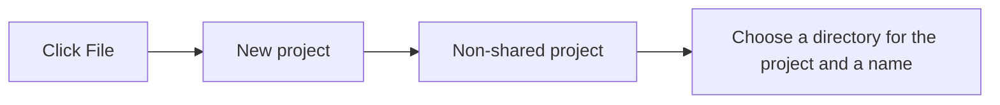
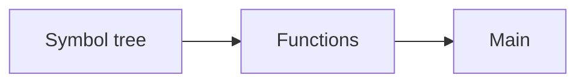
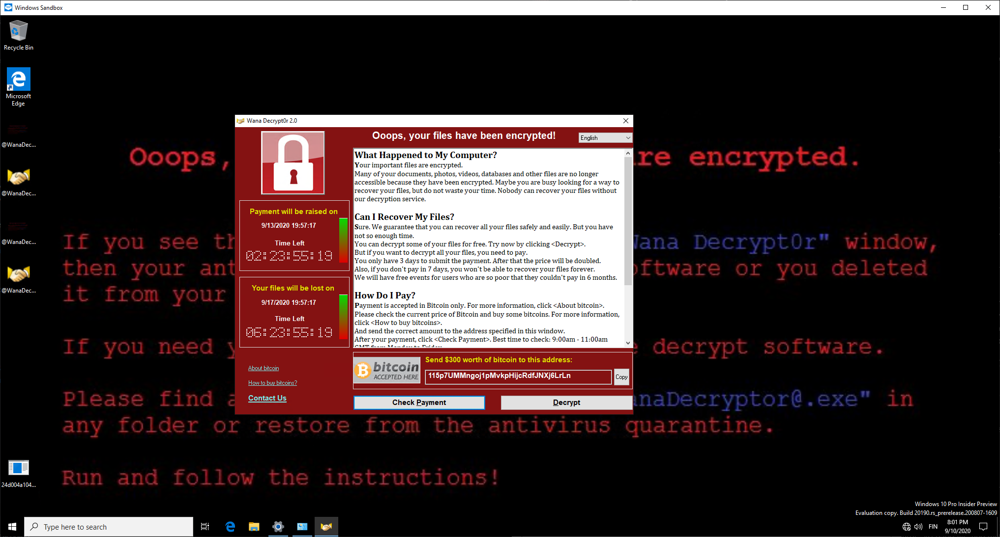

Software and Hardware Security Lab 4: Reverse-engineering and malware analysis.
====
## ToC

* Introduction
  * [Preliminary tasks](#preliminary-tasks)
  * [Background](#background)
  * [Grading](#grading)
* Tasks
  * [Task 1: Reverse engineering on `x86_64` native binary](#task-1-reverse-engineering-x86_64-native-binary)
  * [Task 2: Identifying malicious documents](#task-2-identifying-malicious-documents)
  * [Task 3: Deeper analysis of the MS Office Document](#task-4-deeper-analysis-of-the-ms-office-document)
  * [Task 4: Static analysis of trojan](#task-4-static-analysis-of-trojan)
  * [Task 5: Dynamic &|| static analysis for more complicated sample](#task-5-dynamic--static-analysis-for-more-complicated-sample)

# Introduction

## Preliminary tasks

It is recommended to read at least the following articles at some level to get familiar with the topic.

### For the second and third tasks

What are [macros in Office documents, and why they could pose a thread?](https://docs.microsoft.com/en-us/windows/security/threat-protection/intelligence/macro-malware)

How about [PDF files?](https://www.decalage.info/file_formats_security/pdf)

Take a look at [SANS DFIR short guide](https://sansorg.egnyte.com/dl/IQ3GhaH868/) for analysing malicious documents. We are using some of the tools.

Further reading about malicious PDF and Office malware is [available in here.](https://www.tandfonline.com/doi/full/10.1080/19393555.2020.1723747?scroll=top&needAccess=true) It is long but quite all-answering. (Available in the University Network (can be accessed [via VPN](https://www.oulu.fi/ict/openvpn) or SSH tunneling.)


Even more reading (optional), slides from the author of the macro-based tools that we are using, are available [here.](https://www.decalage.info/files/eu-19-Lagadec-Advanced-VBA-Macros-Attack-And-Defence.pdf)


### For the fourth task, these could give some insight into the purpose of the executable

[Rootkit from Wikipedia](https://en.wikipedia.org/wiki/Rootkit)

[What is a DDoS attack?](https://www.cloudflare.com/learning/ddos/what-is-a-ddos-attack/)

[Botnets?](https://www.cloudflare.com/learning/ddos/what-is-a-ddos-botnet/)

We will be de-compiling the .NET Framework project executable to see how malware works on a source-code (C#) level. So, some source code reading ahead!

### For the last task:

The blog post about malware analysis [in here.](https://medium.com/@dunstconsulting/the-different-types-of-malware-analysis-c9bfbaa44739)

[What is a sandbox?](https://www.quora.com/In-computer-security-what-is-a-sandbox)

If you are not familiar with Wireshark, take a brief look at it. [Here is a short tutorial.](https://www.lifewire.com/wireshark-tutorial-4143298)

About memory analysis with Volatility: [here](https://medium.com/@zemelusa/first-steps-to-volatile-memory-analysis-dcbd4d2d56a1) is a good blog post about it. This is automated in the task, but volatility can be used externally as well for the memory dump.

## Background

Malicious programs are potentially harmful to almost every user of the internet.
Some time ago, one was especially causing gray hairs for plenty of people; *Emotet* malware.  Finnish National Cyber Security Centre (NCSC-FI)  released (8/2020)  [a yellow level of warning](https://www.kyberturvallisuuskeskus.fi/en/emotet-malware-actively-spread-finland) about malware; and how big the risk of facing this malware is at the moment for organisations.
Maybe the COVID-19 pandemic made botnet operators give up on their vacation, and they were pushing new variations of the old malware.

There are many ways for malware to spread.
This one is using as one, old but still working tactic where the user is involved: email attachments.
An innocent-looking attachment in the innocent-looking email message could contain something that you did not expect.
The content of the attachment is usually made to be something you might be more compelling to open: invoices, receipts, legal documents, and more. *In 2017, according to Cisco, 38% of malicious file distributors belonged to Office Suite file extensions and 14% contained the PDF file extension. [[1]](https://www.tandfonline.com/doi/full/10.1080/19393555.2020.1723747?scroll=top&needAccess=true).*

*Emotet* is currently known mostly as an *information stealer*. It is [RAT](https://www.howtogeek.com/410634/what-is-rat-malware-and-why-is-it-so-dangerous/) (Remote Access Trojan) on the computer and can receive almost arbitrary commands for making actions for infected computers.

This exercise is mostly based on something similar.
A malicious document file is doing something more on your computer than you thought! *However, files here are not dangerous, but they can be flagged by some anti-virus products. It is recommended to handle them in Linux-based operating systems!* **With one exception; the malware of the final task (WannaCry) is ransomware and it should not be executed on a Windows machine! Even better, don't get it into your Windows host machine.**

In the second task, we try to identify whether the PDF or Office document file is clean or malicious and further try to analyze what suspicious they are doing.

In the third task, we will take a look for *.eml* file (Saved email message), and try to analyze its attachment(s). How far can we go?

In the fourth task, we are analysing something that an attachment in the previous task attempts to download and install.
This executable was part of a real-life incident, which was used to deploy a botnet network for performing DDoS attacks against official Finnish government websites and other targets.
Malware was originally distributed as Trojan Horse, a Steam Code Generation application that was supposed to give you free Steam codes. (What it of course did not do).

In the last task of the exercise, there is a possibility to analyze another common malware, *WannaCry* which is infamous ransomware and caused some chaos some years ago. It had worm-like properties by exploiting some vulnerabilities and spreading mostly without user involvement.

---
Grading
---
Make a short step-by-step report (what, why, and how) of the following tasks, and include possible source codes and the most important command line commands used in those tasks.
It's recommended to read all tasks before starting. Actual instruction for what to do are ***in bold and italics*** on each task.

You are eligible for the following grades in this exercise by doing tasks as defined. Great ideas and implementations could compensate for some poorly implemented ones.
*Upper grade requires that all previous tasks have been done as well.*

It is estimated that you can do Tasks 1 and 2 during the lab session (4 hours).

Tasks 3, 4, and 5 are more advanced or time-consuming than earlier ones. Implementation will very likely take time outside of the lab.

Task|Grade/Level|Description|
----|:---:|-----------|
[Task 1](#task-1-reverse-engineering-x86_64-native-binary "Reverse engineering on `x86_64` native binary") | 1 | Reverse engineering on `x86_64` native binary
[Task 2](#task-2-identifying-malicious-documents "Identifying malicious documents") | 2 | Identifying malicious documents
[Task 3](#task-3-deeper-analysis-of-the-ms-office-document "Deeper analysis of the MS Office Document") | 3 | Deeper analysis of the MS Office Document
[Task 4](#task-4-static-analysis-of-trojan "Static analysis of trojan") | 4 | Static analysis of trojan
[Task 5](#task-5-dynamic--static-analysis-for-more-complicated-sample "Dynamic &\|\| static analysis for more complicated sample ") | 5 | Dynamic &\|\| static analysis for more complicated sample

Difficulty or workload on tasks is expected to increase as you go forward with them.

You should read instructions properly before starting the task, so you know need to do in overall.

*Return completed tasks to your private GitHub repository!*

---

## **Task 1: Reverse engineering `x86_64` native binary**

<details open>

<br>

We have a binary executable of "ransomware malware".
Or more precisely, Executable and Linkable Format (ELF) file in this case, which is native code binary for Linux systems.

The executable isn't an actual malware; it is just a binary program that takes `input.txt` file and encrypts it to `encrypted_output.txt`.
This is typical behaviour for ransomware, and we want to observe the functionality from reverse-engineering perspective.

What we do in this exercise is find out how the program encrypts files and then reverse its behaviour to get the original input.txt file.
The sample program is very simple and is meant to get you started with the basics of reverse engineering.

Set of recommended tools:
 * Linux utilities
   * `strings`
   * `hexdump`
   * `objdump`
   * `ldd`
 * [Ghidra - Software Reverse Engineering Toolkit](https://ghidra-sre.org/)
 * *ChatGPT* for analysing the code!
 * [CyberChef](https://gchq.github.io/CyberChef/) for data conversions and light encryption

### Basic Linux commands for analysing

First, let's go over a few commands that can be used in Linux to inspect binary executables.

`strings` is a command that prints out all visible strings in the file ( | less is used to make the text easily closable and navigable)

```console
strings <FILENAME> | less
```
You can quit the | less with 'q'

By using the strings command, you may be able to find an encryption key used to encrypt the file and some other interesting things.

However, if you don't find it don't worry there will be an easier way to find it later.

Similarly, you can get visible strings with a whole hex presentation as


```console
hexdump -C <FILENAME> | less
```

`objdump` is a command that gives the raw machine instructions of the file. (This could be used to determine what the executable does but it's long and hard to read)

```console
objdump -D -z <FILENAME>
```
You can find the dynamic dependencies of the dynamically linked ELF file by using the List Dynamic Dependencies utility `ldd`. You don't need this in this task, but can be interesting.
```console
ldd /bin/ls
        libcap.so.2 => /usr/lib/libcap.so.2 (0x0000004002861000)
        libc.so.6 => /usr/lib/libc.so.6 (0x000000400286f000)
        /lib64/ld-linux-x86-64.so.2 => /usr/lib64/ld-linux-x86-64.so.2 (0x0000004000000000)
```


Since reading machine code is a hard and tedious way to understand how the program works, let's use a tool to make it easier.

### Ghidra analysis

We will now analyse the file using [Ghidra](https://ghidra-sre.org/), which is an open-source reverse-engineering software developed by National Security Agency (NSA) for analysing compiled code.
If you are familiar with another reverse-engineering tool, you are allowed to use that instead.

You can install Ghidra on Debian-based systems as

```console
sudo apt install ghidra
```

In Arch Linux as
```console
sudo pacman -S ghidra
```


<details><summary>Setup guide for Ghidra file analysis (Click here)</summary>

<br>

Dependencies for Ghidra:
 * libc6
 * libgcc-s1
 * libstdc++6
 * openjdk-17-jdk

Open ghidra after installing it with:
```console
ghidra
```

Two applications may open.
Leave the one with the project directory open.



Drag the binary file into Ghidra, it should show the executable at the top; then import the file.

Import information shows up.
Close it since it doesn't have much new information.

Click the executable twice in Ghidra to open the code browser and let it analyse the file.

Now we can begin to reverse-engineer the file

</details>

<br>

We can locate all the functions of the file from symbol tree functions; the one we are most interested in is the *main function*.



After it shows the main function in machine code (listing) on the left side, and the actual C code (de-compiled) is on the right side.

Examining the C code we can see the strings `input.txt`, `encrypted_output`.txt, and our encryption key.

On the C code and machine code we can see that our key is passed as a parameter for our first function, which we can call "function A"

There is another non-standard function in the main, which is located after `getline`; we can call this "function B".

Let's try to understand what happens in the function A.

### Function A

The function contains a loop that performs a series of operations in each iteration.

#### Operations performed in the loop:

1. **Subtraction Operation (`substr`)**
   - **Description:** Extracts a part of a string by subtracting from the original string.
   - **Equivalent C++ Function:** `std::string::substr`

2. **String to Integer Conversion (`stoi`)**
   - **Description:** Converts a string representation of an integer into its numerical value.
   - **Equivalent C++ Function:** `std::stoi`

3. **Push to Vector (`push_back`)**
   - **Description:** Appends a value to the end of a vector, expanding its size.
   - **Equivalent C++ Function:** `std::vector::push_back`


**The two biggest clues to what the function does are:**

1. It doesn't have any new values (what is getting returned, the same number?)

2. What are numbers `0x10` and `0x0`?

Based on these, it should be easy to figure out what is the functionality of this function.

### Function B

In the main the function was after getline function and getlines results were passed on to the function B as parameters

getline is function used to get strings from text files and as seen in main these two are the input and output files text that are passed as parameter.

The last parameter is probably what function A gives out the "local_a8"

inside the function there is once again a loop

Inside the loop:

Input and key are compared somehow

character is added into output

This would mean that input and key are compared one character at a time since only 1 character is added to output per loop

It is hard to decipher what the operation that is done to key and input however we can see it clearly in machine language

Clicking on the key's operator[] we can see the function part of machine code

**The two biggest clues to what the function does are:**

1. Keys operator does a machine code instruction that has the same name as our used encryption technique

2. What value is added in push back to output if this operation is true

### Reversing the output text

We should know now 2 things: functionality of the program and the encryption key

Using this information we can reverse the encrypted_output.txt back into the original input.txt

There are two ways you can do this:

 either by using a premade software to reverse the steps on output file using cyberchef (easy)

Writing a program that reverses the functionality of the function to change encrypted_output back to input by coding it (hard)

## Questions:

**What is the key to encryption**

**What does function A and function B do or What does the program do on general level**

**What encryption is used**

**How you reversed the program (cyberchef) or Provide program used for reversing the file (coding)**

**What is the text inside original input**

</details>


## **Task 2: Identifying malicious documents**

<details open>

We have a bunch of document files, and some of them might be something more than just documents. Without opening them (hopefully), could we identify the malicious ones from the clean ones?

One great paper about PDF and Office malware on a general level is [available here.](https://www.tandfonline.com/doi/full/10.1080/19393555.2020.1723747?scroll=top&needAccess=true)
Only available on the University Network (can be accessed [via VPN](https://www.oulu.fi/ict/openvpn) or SSH tunnel).

There are various tools for doing analysis partially for you, and we are going to try out some of them.

Document files can be found from the zip file in [misc/malware](misc/malware) named **maldocs_task1.zip**. Password is *infected*

> **Warning**
> Do not extract the zip files directly into the Windows machine. Antivirus might flag and remove them, even though there are not really malicious files. They just look like and include some patterns malicious files could have.

### Getting started

When we face a suspicious file, what should we do first? The first thing we can do, is to see *if someone has already wondered the same thing and has done the analysis already!*

Many anti-virus tools and other databases are signature based - they might have exact [signature hash](https://medium.com/@tom_rock/fifty-shades-of-malware-hashing-3783d98df59c) or some other regular pattern database for detecting malware. Someone/something might have submitted the file into these places and classified it already.

Some tools/utilities for general analysis; does it exist already?

 * [ClamAV](https://www.clamav.net/) - The biggest Open Source antivirus engine
 * [VirusTotal](https://www.virustotal.com/gui/) - analyze url, file or search by hashes against many AV engines. CLI is available in [here.](https://github.com/VirusTotal/vt-cli)
 * [Yara](https://github.com/VirusTotal/yara) - known as the pattern matching swiss knife. Part of VirusTotal, but can be used as CLI or as a Python library for example. Powered by a list of rules.
 * [Windows Defender](https://docs.microsoft.com/en-us/windows/security/threat-protection/microsoft-defender-antivirus/microsoft-defender-antivirus-in-windows-10) - many times underrated - but has possibly the largest signature and pattern based database among all Windows running antivirus engines. Not used here in practice- but should be noted as a good one because of that. (Even [scary good at collecting samples](https://medium.com/sensorfu/how-my-application-ran-away-and-called-home-from-redmond-de7af081100d))

We could try to use ClamAV:

```console
clamscan <FILENAME>
```

Or with [cincan-command](https://gitlab.com/CinCan/cincan-command):

```console
cincan run cincan/clamav <FILENAME>
```
This will scan the file against ClamAV:s current database.

Similar example with yara:

```console
cincan run cincan/yara -w  "/rules/index.yar" <FILE>
```
To search with all predefined rules of yara. (See package in [here.](https://gitlab.com/CinCan/tools/-/tree/master/stable/yara))


We could also try to use VirusTotal to see if there is already a report about some of our file(s). We could use the graphical Web interface or CLI tool for that.

*In the case of the CLI tool, we should calculate the hash (SHA256) of the file and search based on that at first - in general, uploading is quite a permanent thing and then the file is identified by everyone.*
By searching with file hash, we can see if the file has been already submitted there.

`sha256sum` command can be used for calculating the SHA256 hash of the file.

By using `vt-cli`, we can search for example matches by:
```console
vt -k <APIKEY> file <FILEHASH>
# Or with cincan-command
cincan run cincan/virustotal -k <APIKEY> file <FILEHASH>
```

If you don't want to create an account for VirusTotal, you can use the following API key: *cc36b7771c0c738d7923b3209b6ae6c37a868e9412b3c2dd4109b10bda8f4f6e*. Key is required for CLI, but a single key can make only 4 requests per one minute.

A) **Have files been identified already? Do we find some malicious files based on these tools? Even if there are malicious files, why might they not appear there? What is the disadvantage of using signature-based identification?**

You can for example use tables to showcase your analysis results.

B) **What is the worst thing you can do with a suspicious Microsoft Office document? (Disabled by default)**

C) **Malicious PDF files are also common. How are they usually infecting the machine of the potential victim?**

D) Let's take a deeper look

Some tools for analysing PDF files are listed below. They attempt to identify some known patterns, which usually can be seen in malicious files, and rarely in clean files. They are easiest to use with `cincan-command` but you can install them by yourself. They are also as normal packages in Kali.

 * [pdfid](https://blog.didierstevens.com/programs/pdf-tools)
 * [pdf-parser](https://blog.didierstevens.com/programs/pdf-tools/)

At first, ideally we want to find some suspicious keywords from PDFs such as `/JavaScript`, `/OpenAction`, `/GoTo`, `/URI` and `/RichMedia`,. PDF format is based on a specific structure with possible keyword elements.

Pdf-parser and pdfid are capable for doing that. See `--help` of each tool for creating the correct command. Pdf-parser can print each section of the PDF file.

E.g. pdfid is simple to use at a basic level:
```console
cincan run cincan/pdfid <FILENAME>
```
One of the PDF files is 'malicious'. What it attempts to do, is not working in most PDF readers anymore.


Tools for analysing Microsoft Office documents (OLE2 format, also as [Compound File Binary Format](https://en.wikipedia.org/wiki/Compound_File_Binary_Format)) are listed below. Usually these files end with the file extensions '.doc' or '.xls'

 * [oletools](https://github.com/decalage2/oletools) (set of different tools)
 * [oledump](https://blog.didierstevens.com/programs/oledump-py/)

 For example, the tool `olevba` from oletools can be used for analysing VBA macros from the document, and detecting some suspicious keywords:

```console
cincan run cincan/oletools olevba <FILENAME>
.
.
.
.
+----------+--------------------+---------------------------------------------+
|Type      |Keyword             |Description                                  |
+----------+--------------------+---------------------------------------------+
|AutoExec  |AutoOpen            |Runs when the Word document is opened        |
|Suspicious|powershell          |May run PowerShell commands                  |
|Suspicious|EncodedCommand      |May run PowerShell commands                  |
|Suspicious|Base64 Strings      |Base64-encoded strings were detected, may be |
|          |                    |used to obfuscate strings (option --decode to|
|          |                    |see all)                                     |
|IOC       |calc.exe            |Executable file name                         |
|IOC       |wonderful.ps1       |Executable file name                         |
+----------+--------------------+---------------------------------------------+
```

One of the `.doc` files is 'malicious'.


**Which files might seem to do something abnormal? What do they attempt to do on a general level? Are they executing some code? Include code. Include also the suspicious keywords of PDF.**

It should be noted, that these are not sophisticated malware, just demonstrating basic actions; you can never fully trust the tools.
</details>

## **Task 3: Deeper analysis of the MS Office Document**

<details open>

You work at a very big company as a Security Analyst. Someone has sent a suspicious email message for the Chief IT in charge, and she wants the message analysed by you. She saved the message and delivered it in `.eml` format for you.

File can be found from [here.](misc/malware/Your_great_reward_is_here.eml)

Saved email messages are based on [RFC 822 standard](https://www.ietf.org/rfc/rfc0822.txt) in most of the cases. For example  Thunderbird, Outlook and Gmail export in this format by default, when you want to save a single message.
Could we parse the file and see the content without using these clients?
Could we get potential attachments as well?

One possible way is by using [eml_parser](https://github.com/GOVCERT-LU/eml_parser) Python library. Simple client is packaged by [`CinCan`](https://gitlab.com/CinCan/tools/-/tree/master/stable/eml_parser) and can be used with `cincan-command`.

```console
cincan run cincan/eml_parser --help
```

It has only one optional argument, but it does the work.

This suspicious email has an archived document file as attachment - once it has been acquired, we can start analysing it like in the previous task with the same tools.

**How does it look like? Macros again, are they executed automatically?**

At first, you can take a look for the document with the tools from the previous task.

However, in this case the macro in the document is [*obfuscated*](https://en.wikipedia.org/wiki/Obfuscation_(software)), and by looking at the source, functionality might be hard to understand. Luckily for us, obfuscation is implemented a bit poorly, and we could use a specific tool for emulating the execution of the macro, and see at some level what it is doing!

This tool, called [vipermonkey](https://github.com/decalage2/ViperMonkey) is intended to analyze and deobfuscate malicious VBA Macros in the Microsoft Office files. It attempts to run macros to see interesting commands and their possible arguments. Tool is not perfect, but it works for most of the documents, and also in this case.

You can also use it with `cincan-command`:

```console
cincan run cincan/vipermonkey <ARGS>
```

Emulation might be slow, depending on your computer. ~~Using JIT compilation (`--jit` option) might speed up a little.~~ *It is faster, but produces less detailed output*, might be better to not use in this case.


<details><summary>Tips for deobfuscating the whole macro (Click here)</summary>

Vipermonkey **is not** revealing the one file write operation action, which is related to acquiring embedded data (executable) from the `.doc` file.
*You should figure out how it is stored and extract it.*

Can you guess it from the macro source code? If you have a suitable environment or you know what you are doing, you could run code on real Word and debug runtime variables with breakpoints to see the content. If you can't do that, you can also try to modify source code to print variable contents in such a way that vipermonkey captures the output.

Some helpful documentation about the [Word Visual Basic API.](https://docs.microsoft.com/en-us/office/vba/api/word.document)

Another way is to attempt to find interesting information from unexpected places.

With `oledump`, try to compare sizes and contents of different sections of the file, if there is something strange, particularly in the summary sections. With `oledump`, you can also view/dump contents from different sections.
Vipermonkey finds this same data as potential IOCs; we just don't know what that is, from where it is coming from and what is the purpose.

Macro code is using something from there. Which part was related to the actual file structure?

Documentation for the file structure is available in [here.](https://docs.microsoft.com/en-us/openspecs/office_file_formats/ms-doc/ccd7b486-7881-484c-a137-51170af7cc22)


</details>


**What shell commands macro was executing? Could you shortly describe the idea of carrying the malware and commands? Can we acquire this dropped executable from the document file?**

There are a lot of encoded strings, and the command line tool `base64` could be useful. Also, if the output is a bit strange, you can use the `file` command to see the guessed filetype.

Once we get our hands into this executable, we can go even further. The `file` command might tell the type of the executable, and in this case it is unprotected .NET assembly.

Because of the way of how .NET assemblies are created, they can be reversed back into readable source code, if some extra protection is not applied. And we are about to do that; tool named [ILSpy](https://github.com/icsharpcode/ILSpy) is capable for decompiling .NET assemblies. You can install it by yourself or use it with cincan-command:

```console
cincan run cincan/ilspy <ARGS>
```

**What is this executable doing? How it is trying to persist in the system? Is it dropping even more files?**

It is getting at least one file over the internet, and that is protected somehow. Command line client of `openssl` could be useful here for decrypting it, binary contains required information for doing that.

**Figuring out the functionality of this file is left for the next task.**

</details>

## **Task 4: Static analysis of rootkit**

<details open>

In the previous task, we took the first steps for JIT-compiled binary reverse engineering. The binary was created with **C#** as .NET project.

In this task, we are going to figure out what file [boom.ecrypted](misc/malware/boom.encrypted) is actually doing. Based on the previous task, we have enough information to decrypt the file, and get the original binary file. This task is going little further with binary reversing.


Let's see what the basic Linux command *file* has to say about this one:

```console
$ file boom.exe
boom.exe: PE32 executable (GUI) Intel 80386 Mono/.Net assembly, for MS Windows
```

Looks like we are probably facing .NET assembly again.

We can still use previously mentioned [ILSpy](https://github.com/icsharpcode/ILSpy).  Another similar tool, [dnSpy](https://github.com/0xd4d/dnSpy) is great for GUI based usage, when the Windows machine is available.

When using `ILSpy`, pay attention to the tool parameters. The one about whole project decompilation is really useful in this case. Decompilation might take some time. Files are not protected at all.

Tool can be used with `cincan-command`:
```console
cincan run cincan/ilspy <ARGS> <FILE>
```

This malware was written in Visual Basic (we can see the code as C#) and looks like it has been a Microsoft Visual Studio project.

**Now, the intention of this task is to write a short report on what the program is actually doing.**

Since we can read the program mostly in C#, it shouldn't be that hard at all. (In most cases malware is written in C language or protected somehow, and on those cases we might need to read pure machine instructions instead.)

You are free to use any tools you want, as long as you are not making analysis in your host system in an unsafe environment. Even though this malware is not dangerous anymore, it's good to have principles, and it leaves some files on your machine anyway.

**TIP:** In case .resource files (binary type) are provided instead of .resx format, you can convert it into .resx format from command line as:

`resgen Resource.resource Resource.resx` (you might need to install the `mono-complete` package (Debian) for that)

[.Resx files?](https://docs.microsoft.com/en-us/previous-versions/visualstudio/visual-studio-2008/ekyft91f(v=vs.90))

If you have up-to-date Windows 10 machine with Pro, Enterprise or Education licence, you can use [Windows Sandbox](https://docs.microsoft.com/en-us/windows/security/threat-protection/windows-sandbox/windows-sandbox-overview) for executing the files, if you want to, particularly for seeing the hidden GUI. Another way is to use [Windows Test image](https://developer.microsoft.com/en-us/microsoft-edge/tools/vms/) on VMware or other virtualization solutions.


>**Answer *at least* to these questions in your report (if they differ from your template, use these in confusion):**
* What was the connected domain? What did it do at first? Did it enable something that further steps succeeded?
* This file contains two additional binaries. (These files have been encoded to .resx file somehow) What are their names? How are those files used?
* **Find a way** to reverse these files as well, and include the general purposes of these files as well to your report. Additionally:
  * How were bots controlled? There were at least two ways, describe the automatic approach at least.
  * Some source code or ideas of some common DDoS tools have been used in this malware. Describe three of them. It's enough to identify tools, you can look for information about them elsewhere.
  * Malware actually contains a hidden GUI for DDoS tools it is using. Can you find and use it? Describe how you did/could do it.


</details>

## Task 5: Dynamic &|| static analysis for more complicated sample

<details open>

You have an option to do a predefined task below or suggest some other task you would do. **Something interesting** in botnets or malware, but we haven't dealt with it yet? Feel free to implement and show us what you got. **Your task has to be approved by an assistant before you can start doing it.**

## Rootkit analysis - pre-defined task 1

TBA

## WannaCry - pre-defined task 2

One of the required skills of an analyst or digital forensics guy is to get your analysis environment up and running. Sometimes this might take more time than analysis itself.

Ever heard about WannaCry malware? Four years ago (2017), this malware caused a lot of troubles in hospitals and other organisations.




This malware was a ransomware attack, and encrypted all of the important files of the machine. It exploited some vulnerabilities, which gave it self-spreading properties, making it a *worm*. Luckily there was a flaw (or intended property), which was so called *kill switch*, and stopped the spreading of malware in the cases when the machine was able to connect to the internet. Every time when malware was executed, it looked for some domain. Based on the result, malware did something.
**In this task, we will a take look for the original [*dropper*](https://en.wikipedia.org/wiki/Dropper_(malware)) of WannaCry. Only this specific dropper contained a so-called kill-switch.**

What we want to do at first, is to make *dynamic analysis for it.* It means, and we are executing the malware, and see what actually happens.

When you want to analyze malware, you don't usually want to infect your own machine. Instead, you want to run it in some safe environment. Additionally, an easy way to undo changes would be helpful if you want to repeat the process somewhat easily.

Virtual machines are one good solution. Snapshot feature allows easy way to roll back into the situation, where you were before the moment of execution. Modern malware might even detect virtual environments, and therefore are hiding their malicious activities, but we are ignoring it now.

We might have been using virtual machines already at this point, but now we are taking this a little further.

The malware is located in the `misc` folder, it is zipped twice and password is `infected`.

### The dynamic analysis

You have three options, and you have to mostly figure out things by yourself:

  * Make analysis by using F-Secure [SEE (Sandboxed Execution Environment)](https://github.com/F-Secure/see)
    * You have to set up the environment by yourself. See [documentation](https://see.readthedocs.io/en/latest/) for steps.
    * Use Debian Stretch based Linux as installation system for SEE; it might save some hair
    * Sample Python code for making network analysis, memory dump and disk analysi is available here: [misc/sandbox.py](misc/sandbox.py). Note, that you need to configure agents correctly corresponding the code.
    * Some tips are mentioned in [here.](see/README.md)
    * You can see example disk changes that WannaCry is causing in [here.](see/disklogs/WannaCry_example_diskchanges.json)

  * Make analysis with [Cuckoo Sandbox.](https://cuckoosandbox.org/) Setting up the environment is not very straightforward. Hard!
  * Not automated analysis (Using native Windows Sandbox or Windows in VirtualBox/VMware)
    * You have to capture network traffic manually and take memory dump by yourself
    * [Windows Sandbox](https://docs.microsoft.com/en-us/windows/security/threat-protection/windows-sandbox/windows-sandbox-overview) (Native on latest Windows 10 version: Pro, Enterprise or Education licence required)
        * You can quite safely drop files on there and execute them

    * Windows Test images are available in [here.](https://developer.microsoft.com/en-us/microsoft-edge/tools/vms/) Windows 7 is recommended as you can use volatility2. It works with `cincan-command` as well.
    * [Wireshark](https://1.eu.dl.wireshark.org/win64/) (Choose .exe file)
      * Capturing network traffic inside Sandbox or virtualized Windows. Depending on the host, it might be done outside the sandbox as well by selecting correct adapter.
    * Acquiring memory dump inside from live system: [LiveKD](https://docs.microsoft.com/en-us/sysinternals/downloads/livekd) (` .\livekd64.exe -o memory.dmp`)
      * Note: You might need [volatility3](https://github.com/volatilityfoundation/volatility3) for analysing latest Windows 10
    * On VirtualBox or VMware, taking a memory dump is easier.


In case your Sandbox did not make analysis already, you can manually use [volatility2](https://github.com/volatilityfoundation/volatility) or [volatility3](https://github.com/volatilityfoundation/volatility3) for acquired memory dump; consult their documentation for making the analysis.


**In all of the cases, you are expected to acquire at least a memory dump (and find mutexes) and capture network traffic (and find URL), and do simple static analysis afterwards!**

* **Malware makes a single HTTP request when connection is available; capture it with Wireshark and show it. E.g. screenshot and packet data capture summary. When connection is not available, it encrypts the machine...**
* **In memory analysis (you are expected to do this, when connection is not available == it encrypts the machine), you can use the plugin `mutantscan` of Volatility. What is mutex/mutant in malware analysis? What is the mutex of this particular malware? In the best case, if you create the same mutex before executing the malware, what would happen? Provide Volatility output file/screenshot.**
* Verify the URL - make simple static analysis:

  * You can use (and it is recommended to use) for example [radare2](https://github.com/radare/radare2) for reverse engineering this executable. In practice, we are disassembling binary to machine instructions, and looking into the code of malware in assembly language. Radare2 will be used in the future as well.

  * Cheatsheet for Radare2 can be found [here](https://github.com/radare/radare2/blob/master/doc/intro.md).

  * **Do you find the same URL that you captured with Wireshark? Which function calls it? What are the conditions/functionality of binary when calling the the URL and shortly after?**

**Make a short report including sections above. Include, how you did the dynamic analysis/set up the environment and took the memory dump and captured the network traffic. You can do even more if you want...**

#### Extra
You can also try to use tool called [Minion](https://gitlab.com/CinCan/minion) with [these](https://github.com/ncsc-fi/minion-rules) rules to acquire a lot of information from the memory dump file. It requires a working Docker and should be used on the Linux machine.

##### For Windows Sandbox

* Additional utilities, maybe or maybe not useful
  * https://github.com/karkason/pywinsandbox
  * https://github.com/microsoft/Windows-Sandbox-Utilities

</details>

