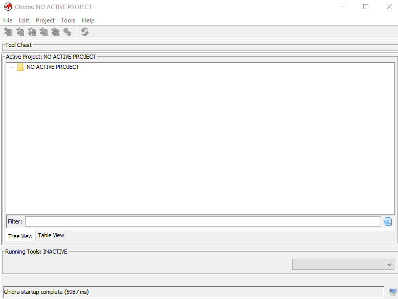
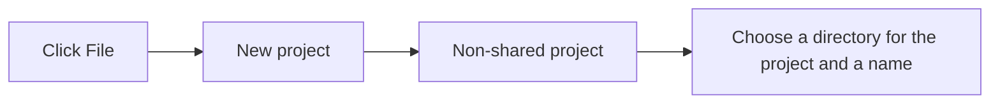
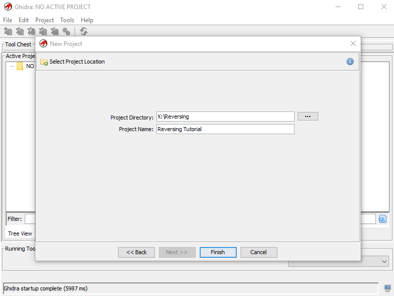
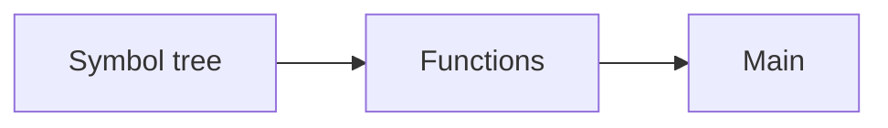
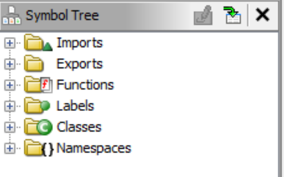
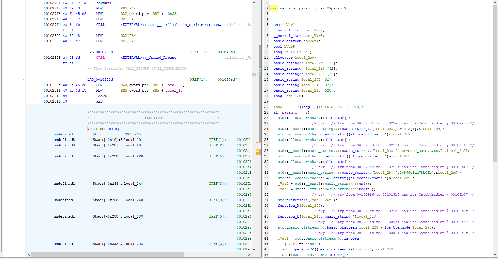
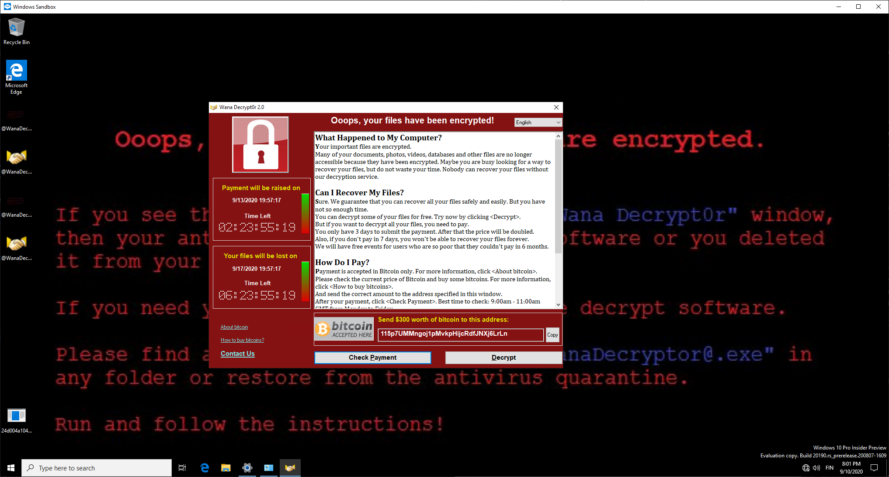

Software and hardware security lab 4: Reverse engineering and malware analysis
==============================================================================

## Table of contents

- Introduction
  - [Preliminary tasks](#preliminary-tasks)
  - [Background](#background)
  - [Grading](#grading)
- Tasks
  - [Task 1: Reverse engineering on `x86_64` native binary](#task-1-reverse-engineering-x86_64-native-binary)
  - [Task 2: Identifying malicious documents](#task-2-identifying-malicious-documents)
  - [Task 3: Deeper analysis of the MS Office document](#task-3-deeper-analysis-of-the-ms-office-document)
  - [Task 4: Static analysis of trojan](#task-4-static-analysis-of-trojan)
  - [Task 5: Dynamic &|| static analysis for more complicated sample](#task-5-dynamic--static-analysis-for-more-complicated-sample)

# Introduction

## Preliminary tasks

In this lab, you will dive into reverse engineering and malware analysis. These exercises are designed to help you understand how to dissect malicious software, examine its behaviour, and identify potential threats.
We recommend reading the following materials to get familiar with the topics.

### For the first task

Install and experiment with [Ghidra](https://ghidra-sre.org/).
Ghidra is a powerful software reverse engineering framework created and maintained by the National Security Agency (NSA). It helps in analysing raw binary files and gives you a better understanding of what the file in question does.

This lab only provides a brief overview of reverse engineering.
If you are interested in learning more, you can read this [e-book](https://0xinfection.github.io/reversing/), which includes tutorials covering x86, x86_64, 32-bit ARM, and 64-bit ARM architectures.

### For the second and third tasks

What are [macros in Office documents, and why could they pose a threat?](https://learn.microsoft.com/en-us/windows/security/threat-protection/intelligence/macro-malware) How do these malicious documents work?

What about [PDF files?](https://www.decalage.info/file_formats_security/pdf)

Take a look at the [SANS DFIR short guide](https://sansorg.egnyte.com/dl/IQ3GhaH868/) for analysing malicious documents. This guide introduces some of the tools we will use in this lab.

Further reading about malicious PDF and Office documents is [available here](https://www.tandfonline.com/doi/full/10.1080/19393555.2020.1723747?scroll=top&needAccess=true). It is long but quite comprehensive. (Available in the university network, or accessible [via VPN](https://www.oulu.fi/ict/openvpn) or SSH tunnelling.)

Optional: More documentation from the author of the macro-based tools used in this lab is available on the [oletools project page](https://www.decalage.info/python/oletools).

### For the fourth task

These resources provide useful background on the purpose of the executable:

[What is a DDoS attack?](https://www.cloudflare.com/learning/ddos/what-is-a-ddos-attack/) How does it work, and what can it do?

[What is a botnet?](https://www.cloudflare.com/learning/ddos/what-is-a-ddos-botnet/) What are botnets, and what are they used for?

We will decompile a .NET executable to see how malware works at the source-code (C#) level, so there will be some source code reading ahead!

### For the last task

Read a primer on [different types of malware analysis](https://medium.com/@dunstconsulting/the-different-types-of-malware-analysis-c9bfbaa44739).

Review the definition and purpose of a [security sandbox](https://csrc.nist.gov/glossary/term/sandbox) from NIST.

If you are not familiar with packet capture and traffic inspection, consult the [Wireshark user guide](https://www.wireshark.org/docs/wsug_html_chunked/).

For volatile memory analysis, consult the [Volatility 3 documentation](https://volatility3.readthedocs.io/en/latest/). While the automated laboratory environment handles initial capture, Volatility can also be used directly on the memory dump.

The [mutantscan plugin documentation](https://volatility3.readthedocs.io/en/latest/volatility3.plugins.windows.mutantscan.html) covers scanning for mutexes in a memory image. For background on what mutexes are at the operating system level, see Microsoft's documentation on [mutex objects](https://learn.microsoft.com/en-us/windows/win32/sync/mutex-objects).

WannaCry spread by exploiting a vulnerability in SMBv1; the original [Microsoft security bulletin MS17-010](https://learn.microsoft.com/en-us/security-updates/securitybulletins/2017/ms17-010) describes the affected software. You can compare the domain you find in the binary against the [indicators published by CISA](https://www.cisa.gov/news-events/alerts/2017/05/12/indicators-associated-wannacry-ransomware).

## Background

Malicious programs are potentially harmful to almost every internet user.
One notorious historical example is the _Emotet_ malware family. In August 2020, the Finnish National Cyber Security Centre (NCSC-FI) released [a yellow-level warning](https://www.kyberturvallisuuskeskus.fi/en/emotet-malware-actively-spread-finland) highlighting the substantial risk the malware posed to organisations. A coordinated international law enforcement effort [disrupted Emotet's global infrastructure](https://www.europol.europa.eu/media-press/newsroom/news/world%E2%80%99s-most-dangerous-malware-emotet-disrupted-through-global-action) in January 2021, though it remains a classic case study in modular malware architecture. You can learn more about its operations in this [CISA cybersecurity advisory](https://www.cisa.gov/news-events/cybersecurity-advisories/aa20-280a).

There are many ways for malware to spread.
This lab focuses on a common tactic that relies on user interaction: email attachments.
An innocent-looking attachment in an innocent-looking email can easily contain something you did not expect.
The attachment content is usually designed to resemble everyday correspondence that recipients feel compelled to open, such as invoices, receipts, or legal notices. While Microsoft has since disabled VBA macros by default for documents originating from the internet, malicious documents and PDF files remain widely used delivery vectors, and archive containers such as ZIP or ISO files packaging malicious scripts remain common. The [ENISA Threat Landscape 2026](https://www.enisa.europa.eu/publications/enisa-threat-landscape-2026) notes that social engineering and phishing continue to be common enabling tactics.

_Emotet_ was primarily known as an _information stealer_. It acted as a [remote access trojan (RAT)](https://attack.mitre.org/techniques/T1219/) on the computer and could receive arbitrary commands to carry out actions on infected machines. An information stealer RAT is designed to steal information from the infected machine, typically by logging keystrokes, taking screenshots, and exfiltrating files. Emotet was also well known for its ability to download and install additional malware.

This lab is based on similar scenarios.
A malicious document can do far more on your computer than you might think! _However, the files here are safe educational samples, although some antivirus products may flag them. We recommend handling them in a Linux-based environment._

> [!WARNING]
> **With one exception: the malware in the final task (WannaCry) is real ransomware and must never be executed on a Windows machine! Even better, keep it completely off your Windows host machine. Exercise extreme caution!**

In the first task, we begin by taking a brief look at reversing a simple `x86_64` ELF binary.

In the second task, we try to identify whether a PDF or Office document is clean or malicious, and analyse what suspicious activities it performs.

In the third task, we examine an `.eml` file (a saved email message) and analyse its attachment.

In the fourth task, we analyse a payload that the attachment in the previous task attempts to download and install.
This executable was part of a real-life incident used to deploy a botnet for DDoS attacks against Finnish government websites and other targets.
The malware was originally distributed disguised as a trojan horse application promising free Steam codes (which it naturally did not provide).

In the last task of the exercise, you have the opportunity to analyse _WannaCry_, the infamous ransomware that caused chaos a few years ago by using worm-like propagation to spread without user interaction.

---

## Grading

Make a short step-by-step report (what, why, and how) for each task, including any source code and the key command-line commands you used.
We recommend reading all tasks before starting. The actual instructions for what to do are highlighted _**in bold and italics**_ in each task.

Each task awards 1 point, giving a total of 5 points for completing the lab. Well-explained ideas and implementations can compensate for minor shortcomings in others.
_Earning higher points requires completing all previous tasks as well._

It is estimated that you can complete tasks 1, 2 during the lab session (4 hours).

Tasks 3, 4, and 5 are more advanced and time-consuming, so completing them will likely take time outside the lab.

| Task                                                                   | Points | Description                                       |
| ---------------------------------------------------------------------- | :----: | ------------------------------------------------- |
| [Task 1](#task-1-reverse-engineering-x86_64-native-binary)             |   1    | Reverse engineering an `x86_64` native binary     |
| [Task 2](#task-2-identifying-malicious-documents)                      |   1    | Identifying malicious documents                   |
| [Task 3](#task-3-deeper-analysis-of-the-ms-office-document)            |   1    | Deeper analysis of the MS Office document         |
| [Task 4](#task-4-static-analysis-of-trojan)                            |   1    | Static analysis of trojan                         |
| [Task 5](#task-5-dynamic--static-analysis-for-more-complicated-sample) |   1    | Dynamic and static analysis of an advanced sample |

The difficulty and workload are expected to increase as you progress through the tasks.

Please read the instructions carefully before starting each task so that you know what to do overall.

_Submit completed tasks to your private GitHub repository!_

---

## **Task 1: Reverse engineering an `x86_64` native binary**

> [!NOTE]
> You can have this task automatically graded by completing it in the new experimental system.

<details open>

<br>

In this task, we examine a binary executable that acts like a simulated ransomware payload.
It is an executable and linkable format (ELF) binary, the standard executable format on Linux systems.

The executable is not actual malware. It is a benign program that takes a string as a command-line argument and writes an encrypted version to a specified file, mimicking how ransomware encrypts files on disk.
We want to analyse this behavior from a reverse engineering perspective.
In the final task of this lab, we will examine an authentic sample.
In this exercise, your goal is to find out how the program encrypts the string and then reverse its logic to recover the original text.

You can find the example binary and `encrypted_output.txt` from [the example directory](misc/task1_example/). It will be different, when you are doing it with the automated system!

Recommended tools:

- Standard Linux utilities:
  - `strings`
  - `hexdump`
  - `objdump`
  - `ldd`
- [Ghidra](https://ghidra-sre.org/) (software reverse engineering suite)
- An LLM (such as ChatGPT) to help analyse decompiled code snippets
- [CyberChef](https://gchq.github.io/CyberChef/) for data conversions and cryptographic operations

### Basic Linux commands for analysis

First, let's review a few commands that can be used in Linux to inspect binary executables.

`strings` extracts and prints printable character sequences from the binary. Piping into `less` lets you scroll through the output conveniently:

```console
strings <FILENAME> | less
```

You can exit `less` by pressing `q`.

Using `strings`, you might find the encryption key used to encrypt the file, along with other interesting indicators.

However, if you do not find it immediately, do not worry: Ghidra will make it easier to locate. In real malware, keys are rarely stored in plain text.

Similarly, you can inspect both raw bytes and hexadecimal representations using `hexdump`:

```console
hexdump -C <FILENAME> | less
```

`objdump` disassembles the binary, displaying its raw machine instructions. While disassembly shows exactly what the program executes, reading assembly directly can be slow and demanding:

```console
objdump -D -z <FILENAME>
```

You can inspect dynamic library dependencies using `ldd`. While not strictly required for this task, it helps identify the shared libraries on which a binary depends:

```console
ldd /bin/ls
        libcap.so.2 => /usr/lib/libcap.so.2 (0x0000004002861000)
        libc.so.6 => /usr/lib/libc.so.6 (0x000000400286f000)
        /lib64/ld-linux-x86-64.so.2 => /usr/lib64/ld-linux-x86-64.so.2 (0x0000004000000000)
```

Because reading raw assembly is time-consuming, decompilers help translate machine instructions into readable pseudocode.

### Ghidra analysis

We will now analyse the file using [Ghidra](https://ghidra-sre.org/), an open-source reverse engineering framework developed by the National Security Agency (NSA) for analysing compiled code.
If you are familiar with another reverse engineering tool, you are welcome to use that instead. Some alternative tools are commercial and quite expensive. If you are interested in comparing decompilation outputs from different tools on small binaries, you can explore [Dogbolt](https://dogbolt.org/).

You can install Ghidra on Debian-based systems with:

```console
sudo apt install ghidra
```

On Arch Linux:

```console
sudo pacman -S ghidra
```

<details><summary>Setup guide for Ghidra file analysis (click to expand)</summary>

<br>

Dependencies for Ghidra:

- libc6
- libgcc-s1
- libstdc++6
- openjdk-17-jdk

Launch Ghidra after installing it:

```console
ghidra
```

Two windows may open; keep the main project manager window open.




```mermaid
flowchart LR
    A[Click File] --> B[New project]
    B --> C[Non-shared project]
    C -->  D[Choose a directory for the project and a name]
```



Drag the binary file into Ghidra and import it into the project.

Import information shows up.
Close it since it doesn't have much new information.

Double-click the executable in Ghidra to open the CodeBrowser, and allow it to analyse the file when prompted (the default analysis settings are sufficient).

Now we can begin reverse engineering the binary.

</details>

<br>

We can locate all the functions in the binary by exploring **the symbol tree**. The symbol tree provides a hierarchical view of the symbols in the program, such as functions, classes, and variables. The one we are most interested in is the `main` function.


```mermaid
flowchart LR
    A[Symbol tree] --> B[Functions]
    B --> C[Main]
```



To find the main function, click the plus icon next to **Functions** and select **main**.

Ghidra displays the machine instructions (disassembly listing) on the left side, and the decompiled C/C++ pseudocode on the right side.



Examining the decompiled code reveals the string `encrypted_output.txt` and our encryption key. We can also see that the program takes a string argument from the command line. This is the `flag` you are tasked with recovering.

In the decompiled view, we can see that our key is passed as a parameter to an initial helper function, which we will call "function A".

A second non-standard function follows `function_A` in `main`; we will call this "function B".

Let's examine what happens inside function A and function B.

You are welcome to use an LLM to help interpret decompiled snippets. LLMs are particularly effective at identifying standard library idioms from decompiled pseudocode.

### The main function

### Input argument

- **Description:** The `main` function expects one command-line argument, which serves as the `flag` to be encrypted.

### Function A

This function processes a key string in hexadecimal format, transforming it into a sequence of raw bytes. **Note** that an operation is performed on the key before it is passed to Function A. What operation is it?

#### Operations performed in the loop

1. **Length check (`length`)**
   - **Description:** The function checks the length of the key string to determine how many iterations are needed to process the entire string.
   - **Equivalent C++ method:** `std::string::length`

2. **Substring extraction (`substr`)**
   - **Description:** In each iteration, the function extracts a two-character substring from the key string representing a hexadecimal byte.
   - **Equivalent C++ method:** `std::string::substr`

3. **String-to-integer conversion (`stoi`)**
   - **Description:** The extracted two-character hexadecimal substring is converted into its corresponding byte value.
   - **Equivalent C++ method:** `std::stoi`

4. **Appending the byte (`push_back`)**
   - **Description:** The byte obtained from the conversion is appended to the output string, building a sequence of bytes.
   - **Equivalent C++ method:** `std::string::push_back`

**The two primary clues for understanding Function A:**

1. The function processes pairs of characters from a string representing hexadecimal values, converting them into raw byte values.

2. Base 0x10: Passing base 16 (0x10) to `stoi` indicates that each pair of characters is parsed as a hexadecimal integer. Why is this useful in the context of key processing?

Based on these observations, you can determine the overall purpose of Function A.

### Function B

Within the `main` function, the `flag` and the processed key from `function_A` are passed as parameters to Function B.

1. **Size check (`size`)**
   - **Description:** The function checks the size of the input string (`flag`) to determine how many iterations the loop will perform.
   - **Equivalent C++ method:** `std::string::size()`

2. **Character access (`operator[]`)**
   - **Description:** The function accesses individual characters of both the flag and the processed key, pairing each character of the flag with a corresponding byte from the key.
   - **Equivalent C++ method:** `std::string::operator[]`

3. **Character processing**
   - **Description:** In each iteration, these characters undergo an operation that transforms the flag character based on the key byte.

4. **Appending the result (`push_back`)**
   - **Description:** The resulting character from the operation is appended to the output string.
   - **Equivalent C++ method:** `std::string::push_back`

While decompiled C++ template code can look cluttered, inspecting the corresponding assembly instructions makes the underlying operation much clearer.

Selecting the key's `operator[]` in the listing highlights the corresponding assembly instructions.

**The two primary clues for understanding Function B:**

1. Key indexing with `operator[]`: The machine code shows the key being accessed character by character alongside a specific bitwise operation. This gives a direct indication of the function's purpose.

2. The transformed character is appended to the output string. How does this transformation occur?

### Reversing the output text

At this stage, you have identified both the encryption key and the transformation algorithm.

Using this information, you can reverse `encrypted_output.txt` back into the original `flag`.

There are two common ways to accomplish this:

1. Use a tool like [CyberChef](https://gchq.github.io/CyberChef/) to reverse the transformation steps and decrypt the output file (straightforward).

2. Write a short program (in Python, C, or Rust) that reverses the logic to convert `encrypted_output.txt` back into the original input string (or prompt an LLM to help build the script).

### Questions

> [!NOTE]
> You can have this task automatically graded in the experimental system.
> If you complete it on there, you do not need to submit written answers for this task in GitHub, though answering them will help verify your understanding.

**1. What is the key used for encryption?**

**2. What do function A and function B do, and what does the program do on a general level?**

**3. What encryption method has been used?**

**4. How did you reverse the ciphertext (using CyberChef or a custom script)? If you wrote a script, include it in your report.**

**5. What is the text inside the original input?**

If you want to explore Ghidra further, check out the [awesome-ghidra repository](https://github.com/AllsafeCyberSecurity/awesome-ghidra) for a curated list of plugins and resources.

</details>

## **Task 2: Identifying malicious documents**

<details open>

We have a bunch of document files, and some of them might be something more than just documents. Without opening them (hopefully), could we identify the malicious ones from the clean ones?

One great paper about PDF and Office malware on a general level is [available here.](https://www.tandfonline.com/doi/full/10.1080/19393555.2020.1723747?scroll=top&needAccess=true)
Only available on the University Network (can be accessed [via VPN](https://www.oulu.fi/en/for-students/supporting-your-studies-and-contact-information-students/it-services-students/remote-desktops) or SSH tunnel).

There are various tools for doing analysis partially for you, and we are going to try out some of them.

Document files can be found in the zip file in [misc/malware](misc/malware) named **maldocs_task1.zip**. Password is _infected_.

> **Warning**
> Do not extract the zip files directly into the Windows machine. Antivirus might flag and remove them, even though there are not really malicious files. They just look like and include some patterns malicious files could have.

### Used libraries

Most of the used libraries for tasks 2. and 3. can be installed with pacman and a Python virtual environment:

```console
sudo pacman -S --needed clamav yara python-pip git base-devel
python -m venv .venv
source .venv/bin/activate
pip install oletools eml-parser olefile
```

The system Python on modern distributions is marked as externally managed, so installing with pip directly is refused. Create a virtual environment instead, and activate it in each new shell (`source .venv/bin/activate`).

oledump, pdfid, pdf-parser Python scripts can be installed from GitHub using:

```console
git clone https://github.com/DidierStevens/DidierStevensSuite.git
```

### Getting started

When we face a suspicious file, what should we do first? The first thing we can do is to see _if someone has already wondered the same thing and has done the analysis already!_

Many anti-virus tools and other databases are signature-based - they might have an exact [signature hash](https://blog.gdatasoftware.com/2021/09/an-overview-of-malware-hashing-algorithms) or some other regular pattern database for detecting malware. Someone/something might have submitted the file to these places and classified it already.

Some tools/utilities for general analysis; do they exist already?

- [ClamAV](https://www.clamav.net/) - The biggest Open Source antivirus engine
- [VirusTotal](https://www.virustotal.com/gui/) - analyse URL, file, or search by hashes against many AV engines. CLI is available [here.](https://github.com/VirusTotal/vt-cli)
- [YARA](https://github.com/VirusTotal/yara) - the pattern matching Swiss knife, installed as the classic `yara` tool. It can be used as a CLI or as a Python library, powered by a list of rules. Its successor, [YARA-X](https://github.com/VirusTotal/yara-x), is also available.
- [Microsoft Defender Antivirus](https://learn.microsoft.com/en-us/defender-endpoint/microsoft-defender-antivirus-windows) - often underestimated, but possesses one of the largest signature and heuristic pattern databases among Windows-based endpoint protection engines. Not used directly in this lab, but notable for its scale. (Even [scary good at collecting samples](https://medium.com/sensorfu/how-my-application-ran-away-and-called-home-from-redmond-de7af081100d))

We could try to use ClamAV:

```console
sudo freshclam
clamscan <FILENAME>
```

`freshclam` updates the virus database. It is required before the first scan: with an
empty database `clamscan` reports `Infected files: 0` without scanning anything.

This will scan the file against ClamAV's current database.

A similar example with `yara`:

```console
yara -w  <Rules> <FILE>
```

To search with all predefined rules of yara. (See the package [here.](https://github.com/Yara-Rules/rules.git))

We could also try to use VirusTotal to see if there is already a report about some of our file(s). We could use the graphical Web interface or CLI tool for that.

_In the case of the CLI tool, we should calculate the hash (SHA256) of the file and search based on that at first - in general, uploading is quite a permanent thing and then the file is identified by everyone._
By searching with file hash, we can see if the file has been already submitted there.

By using the VirusTotal website or using API calls with `vt` or `vt-cli` packages we can search for example matches.

If you don't want to create an account for VirusTotal, you can use the following API key: _cc36b7771c0c738d7923b3209b6ae6c37a868e9412b3c2dd4109b10bda8f4f6e_. A key is required for the CLI, but a single key can make only 4 requests per minute.

A) **Have files been identified already? Do we find some malicious files based on these tools? Even if there are malicious files, why might they not appear there? What is the disadvantage of using signature-based identification?**

You can for example use tables to showcase your analysis results.

B) **What is the worst thing you can do with a suspicious Microsoft Office document? (Disabled by default)**

C) **Malicious PDF files are also common. How are they usually infecting the machine of the potential victim?**

D) Let's take a deeper look

Some tools for analysing PDF files are listed below. They attempt to identify some known patterns, which usually can be seen in malicious files, and rarely in clean files. You can install them by yourself; they are also available as normal packages in Kali.

- [pdfid](https://blog.didierstevens.com/programs/pdf-tools)
- [pdf-parser](https://blog.didierstevens.com/programs/pdf-tools/)

At first, ideally, we want to find some suspicious keywords from PDFs such as `/JavaScript`, `/OpenAction`, `/GoTo`, `/URI` and `/RichMedia`. PDF format is based on a specific structure with possible keyword elements.

Pdf-parser and pdfid are capable of doing that.
See `--help` of each tool for creating the correct command. Pdf-parser can print each section of the PDF file.

E.g. pdfid is simple to use at a basic level:

```console
python3 DidierStevensSuite/pdfid.py <FILENAME>
```

One of the PDF files is 'malicious'. What it attempts to do is not working in most PDF readers anymore.

Tools for analysing Microsoft Office documents (OLE2 format, also known as [Compound File Binary Format](https://en.wikipedia.org/wiki/Compound_File_Binary_Format)) are listed below.
Usually, these files end with the file extensions '.doc' or '.xls'.

- [oletools](https://github.com/decalage2/oletools) (set of different tools)
- [oledump](https://blog.didierstevens.com/programs/oledump-py/)

For example, the tool `olevba` from oletools can be used for analysing VBA macros from the document, and detecting some suspicious keywords:

```console
olevba <FILENAME>
.
.
.
.
+----------+--------------------+---------------------------------------------+
|Type      |Keyword             |Description                                  |
+----------+--------------------+---------------------------------------------+
|AutoExec  |AutoOpen            |Runs when the Word document is opened        |
|Suspicious|powershell          |May run PowerShell commands                  |
|Suspicious|EncodedCommand      |May run PowerShell commands                  |
|Suspicious|Base64 Strings      |Base64-encoded strings were detected, may be |
|          |                    |used to obfuscate strings (option --decode to|
|          |                    |see all)                                     |
|IOC       |calc.exe            |Executable file name                         |
|IOC       |wonderful.ps1       |Executable file name                         |
+----------+--------------------+---------------------------------------------+
```

One of the `.doc` files is 'malicious'.

**Which files might seem to do something abnormal? What do they attempt to do on a general level? Are they executing some code? Include code. Include also the suspicious keywords of the PDF.**

Note that these examples are not sophisticated malware. They are just demonstrating the basic actions. You can never fully trust the tools.
</details>

## **Task 3: Deeper analysis of the MS Office Document**

<details open>

You work at a very big company as a Security Analyst. Someone has sent a suspicious email message to the Chief IT in charge, and she wants the message analysed by you.
She saved the message and delivered it in `.eml` format for you.

The file can be found [here.](misc/malware/Your_great_reward_is_here.eml)

Saved email messages are based on the [RFC 822 standard](https://www.ietf.org/rfc/rfc0822.txt) in most cases.
For example, Thunderbird, Outlook, and Gmail export in this format by default, when you want to save a single message.
Could we parse the file and see the content without using these clients?
Could we get potential attachments as well?

There are ways to get the attachment with tools like `ripmime` and `munpack`.

This suspicious email has an archived document file as an attachment - once it has been acquired, we can start analysing it like in the previous task with the same tools.

**What does it look like? Macros again? Are they executed automatically?**

At first, you can take a look at the document with the tools from the previous task.

However, in this case, the macro in the document is [_obfuscated_](<https://en.wikipedia.org/wiki/Obfuscation_(software)>), and by looking at the source, functionality might be hard to understand. Luckily for us, obfuscation is implemented a bit poorly, and we could use a specific tool for emulating the execution of the macro, and see at some level what it is doing!

This tool, called [vipermonkey](https://github.com/decalage2/ViperMonkey), is intended to analyze and deobfuscate malicious VBA Macros in the Microsoft Office files. It attempts to run macros to see interesting commands and their possible arguments.
A tool is not perfect, but it works for most of the documents, and also in this case.

The easiest way to run it is the Docker image:

```console
docker run --rm -v $PWD:/w -w /w cincan/vipermonkey <FILENAME>
```

ViperMonkey is not available on PyPI, and its PyPI-installable GitHub archive does not work on Python 3.10 or newer.

Emulation might be slow, depending on your computer.

<details><summary>Tips for deobfuscating the whole macro (Click here)</summary>

<br>

Vipermonkey **is not** revealing the one file write operation action, which is related to acquiring embedded data (executable) from the `.doc` file.
_You should figure out how it is stored and extract it._

Can you guess it from the macro source code? If you have a suitable environment or you know what you are doing, you could run code on real Word and debug runtime variables with breakpoints to see the content.

> **Note**
> If you can't do that, **you can also try to modify the source code to print variable contents in such a way that vipermonkey captures the output.** Just run the macro alone and again in vipermonkey to see the output of the prints.

Some helpful documentation about the [Word Visual Basic API.](https://learn.microsoft.com/en-us/office/vba/api/word.document)

Another way is to attempt to find interesting information from unexpected places.

With `oledump`, try to compare the sizes and contents of different sections of the file, if there is something strange, particularly in the summary sections. With `oledump`, you can also view/dump contents from different sections.
Vipermonkey finds this same data as potential IOCs; we just don't know what that is, where it is coming from, and what its purpose is.

You can use oledump to extract the specific macros as plaintext and save them into a file with:

```console
python3 DidierStevensSuite/oledump.py -s <macro_number> -v <Malicious_doc> > <OUTPUT_FILE>
```

Macro code is using something from there. Which part was related to the actual file structure?

Documentation for the file structure is available [here.](https://learn.microsoft.com/en-us/openspecs/office_file_formats/ms-doc/ccd7b486-7881-484c-a137-51170af7cc22)

</details>

**What shell commands was the macro executing? Could you briefly describe the idea of carrying the malware and commands? Can we acquire this dropped executable from the document file?**

There are a lot of encoded strings, and the command line tool `base64` could be useful. Also, if the output is a bit strange, you can use the `file` command to see the guessed file type.

Once we get our hands on this executable, we can go even further. The `file` command might tell the type of the executable, and in this case, it is an unprotected .NET assembly.

Because of the way .NET assemblies are created, they can be reversed back into readable source code, if some extra protection is not applied.

And we are about to do that; a tool named [ILSpy](https://github.com/icsharpcode/ILSpy) is capable of decompiling .NET assemblies.

**What is this executable doing? How is it trying to persist in the system? Is it dropping even more files?**

It is getting at least one file over the internet, and that is protected somehow. The command-line interface of `openssl` could be useful here for decrypting it. The binary contains the required information for doing that.

**Figuring out the functionality of this file is left for the next task.**

</details>

## **Task 4: Static analysis of trojan**

<details open>

In the previous task, we took the first steps for JIT-compiled binary reverse engineering. The binary was created with **C#** as `.NET` project.

In this task, we are going to figure out what file [boom.ecrypted](misc/malware/boom.encrypted) is actually doing. Based on the previous task, we have enough information to decrypt the file and get the original binary file.
This task is going a little further with binary reversing.

`boom.encrypted` is included in `misc/malware/` and is the same file the dropped executable would download, so no network download is needed.

Let's see what the basic Linux command _file_ has to say about this one:

```console
$ file boom.exe
boom.exe: PE32 executable (GUI) Intel 80386 Mono/.Net assembly, for MS Windows
```

Looks like we are probably facing .NET assembly again.

We can still use the previously mentioned [ILSpy](https://github.com/icsharpcode/ILSpy). Alternatively, [dnSpyEx](https://github.com/dnSpyEx/dnSpy) (an actively maintained fork of dnSpy) is convenient for GUI-based analysis when a Windows environment is available.

When using `ILSpy`, pay attention to the tool parameters. The one about whole project decompilation is really useful in this case. Decompilation might take some time. Files are not protected at all.

This malware was written in Visual Basic (we can see the code as C#) and looks like it has been a Microsoft Visual Studio project.

**Now, the intention of this task is to write a short report on what the program is actually doing.**

Since we can read the program mostly in C#, it shouldn't be that hard at all. (In most cases malware is written in C language or protected somehow, and in those cases we might need to read pure machine instructions instead.)

You are free to use any tools you want, as long as you are not analysing in your host system in an unsafe environment. Even though this malware is not dangerous anymore, it's good to have principles, and it leaves some files on your machine anyway.

**TIP:** In case .resource files (binary type) are provided instead of .resx format, you can convert it into .resx format from command-line as:

`resgen Resource.resource Resource.resx` (you might need to install the `mono-complete` package (Debian) for that)

[Working with .resx files](https://learn.microsoft.com/en-us/dotnet/core/extensions/work-with-resx-files-programmatically)

If you have an up-to-date Windows 11 machine with Pro, Enterprise, or Education licence, you can use [Windows Sandbox](https://learn.microsoft.com/en-us/windows/security/application-security/application-isolation/windows-sandbox/windows-sandbox-overview) to executing the files, if you want to, particularly for seeing the hidden GUI. Another way is to use [Windows evaluation image](https://www.microsoft.com/en-us/evalcenter/) on VMware or other virtualization solutions.

> **Answer _at least_ to these questions in your report (if they differ from your template, use these in confusion):**

- What was the connected domain? What did it do at first? Did it enable something that further steps succeeded?
- This file contains two additional binaries. (These files have been encoded to .resx file somehow) What are their names? How are those files used?
- **Find a way** to reverse these files as well, and include the general purposes of these files as well to your report. Additionally:
  - How were bots controlled? There were at least two ways; describe the automatic approach at least.
  - Some source code or ideas of some common DDoS tools have been used in this malware. Describe three of them. It's enough to identify tools, you can look for information about them elsewhere.
  - Malware actually contains a hidden GUI for DDoS tools it is using. Can you find and use it? Describe how you did/could do it.

</details>

## Task 5: Dynamic &|| static analysis for more complicated sample

<details open>

You have an option to do a predefined task below or suggest some other task you would do. **Something interesting** in malware analysis or reverse engineering, but we haven't dealt with it yet? Feel free to implement and show us what you got. **Your task has to be approved by an assistant before you can start doing it.**

You could take a look at well-known rootkit malware, for example.
[Well-known repository of malware.](https://github.com/ytisf/theZoo)

## WannaCry - pre-defined task

One of the required skills of an analyst or digital forensics guy is to get your analysis environment up and running. Sometimes this might take more time than analysis itself.

Ever heard about WannaCry malware? In 2017, this malware caused a lot of troubles in hospitals and other organisations.



This malware was a ransomware attack, and encrypted all of the important files of the machine. It exploited some vulnerabilities, which gave it self-spreading properties, making it a _worm_. Luckily there was a flaw (or intended property), which was so called _kill switch_, and stopped the spreading of malware in the cases when the machine was able to connect to the internet. Every time when malware was executed, it looked for some domain. Based on the result, malware did something.
**In this task, we will a take look for the original [_dropper_](<https://en.wikipedia.org/wiki/Dropper_(malware)>) of WannaCry. Only this specific dropper contained a so-called kill-switch.**

What we want to do at first, is to make _dynamic analysis for it._ It means, and we are executing the malware, and see what actually happens.

When you want to analyze malware, you don't usually want to infect your own machine. Instead, you want to run it in some safe environment. Additionally, an easy way to undo changes would be helpful if you want to repeat the process somewhat easily.

Virtual machines are one good solution. Snapshot feature allows easy way to roll back into the situation, where you were before the moment of execution. Modern malware might even detect virtual environments, and therefore are hiding their malicious activities, but we are ignoring it now.

We might have been using virtual machines already at this point, but now we are taking this a little further.

The malware is located in the `misc` folder, it is zipped twice and password is `infected`.

### The dynamic analysis

You have few options, and you have to mostly figure out things by yourself:

- Make analysis with [CAPE Sandbox](https://github.com/kevoreilly/CAPEv2) (the maintained fork of Cuckoo Sandbox). Setting up the environment is not very straightforward. Hard!
- Not automated analysis (Using native Windows Sandbox or Windows in VirtualBox/VMware)
  - You have to capture network traffic manually and take memory dump by yourself
  - [Windows Sandbox](https://learn.microsoft.com/en-us/windows/security/application-security/application-isolation/windows-sandbox/windows-sandbox-overview) (Native on Windows 11 Pro, Enterprise or Education licence required)
    - You can quite safely drop files on there and execute them

  - Windows evaluation images are available in [here.](https://www.microsoft.com/en-us/evalcenter/) Windows 11 is recommended, so you can use Volatility 3.
  - [Wireshark](https://www.wireshark.org/download.html) (Choose .exe file)
    - Capturing network traffic inside Sandbox or virtualized Windows. Depending on the host, it might be done outside the sandbox as well by selecting correct adapter.
  - Acquiring memory dump inside from live system: [LiveKD](https://learn.microsoft.com/en-us/sysinternals/downloads/livekd) (` .\livekd64.exe -o memory.dmp`)
    - Note: You might need [volatility3](https://github.com/volatilityfoundation/volatility3) for analysing latest Windows 11
  - On VirtualBox or VMware, taking a memory dump is easier.
  - Something else? Feel free to show your analysis skills!

In case your Sandbox has not made the analysis already, you can manually use [volatility3](https://github.com/volatilityfoundation/volatility3) for the acquired memory dump and consult its documentation for making the analysis.

**In all of the cases, you are expected to acquire at least a memory dump (and find mutexes), capture network traffic (and find URL), and do a simple static analysis afterward!**

- **Malware makes a single HTTP request when a connection is available; capture it with Wireshark and show it. E.g. screenshot and packet data capture summary. When the connection is not available, it encrypts the machine...**
- **In memory analysis (you are expected to do this, when connection is not available == it encrypts the machine), you can use the plugin `mutantscan` of Volatility. What is mutex/mutant in malware analysis? What is the mutex of this particular malware? In the best case, if you create the same mutex before executing the malware, what would happen? Provide Volatility output file/screenshot.**
- Verify the URL - make simple static analysis:

  - You can use (and it is recommended to use) for example [radare2](https://github.com/radareorg/radare2) for reverse engineering this executable. In practice, we are disassembling binary to machine instructions, and looking into the code of malware in assembly language. Radare2 will be used in the future as well.

  - Cheatsheet for Radare2 can be found [here](https://github.com/radareorg/radare2/blob/master/doc/intro.md).

  - **Do you find the same URL that you captured with Wireshark? Which function calls it? What are the conditions/functionality of binary when calling the the URL and shortly after?**

**Make a short report including sections above. Include, how you did the dynamic analysis/set up the environment and took the memory dump and captured the network traffic. You can do even more if you want...**

##### For Windows Sandbox

- Additional utilities, maybe or maybe not useful
  - https://github.com/karkason/pywinsandbox
  - https://github.com/microsoft/Windows-Sandbox

</details>
