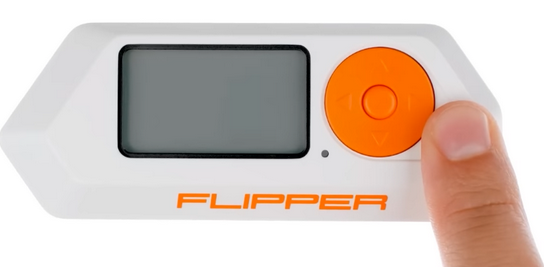
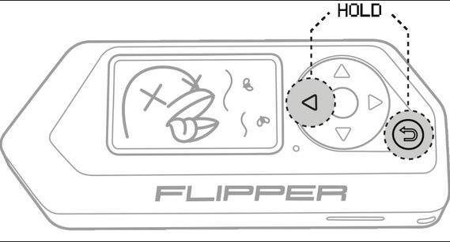
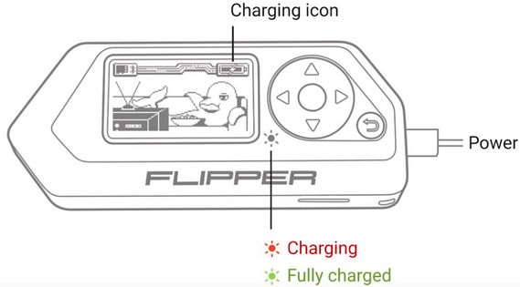
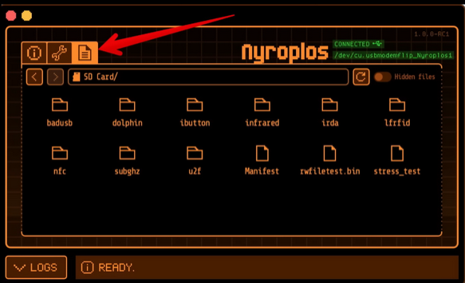
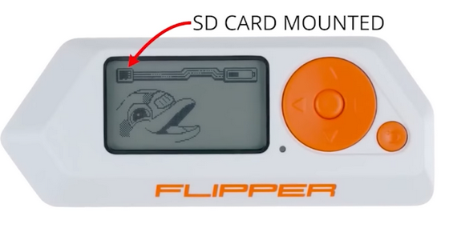
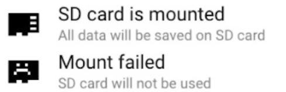
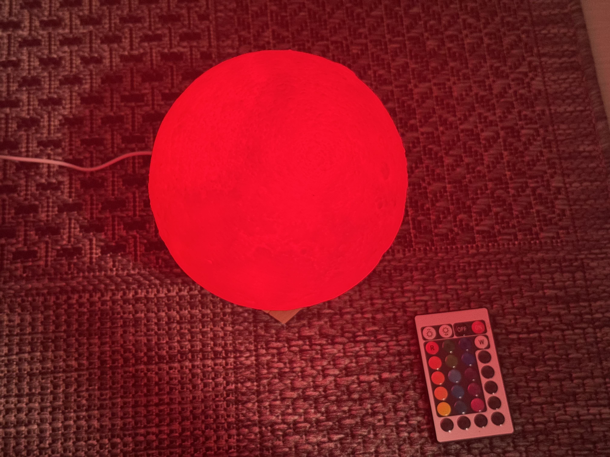
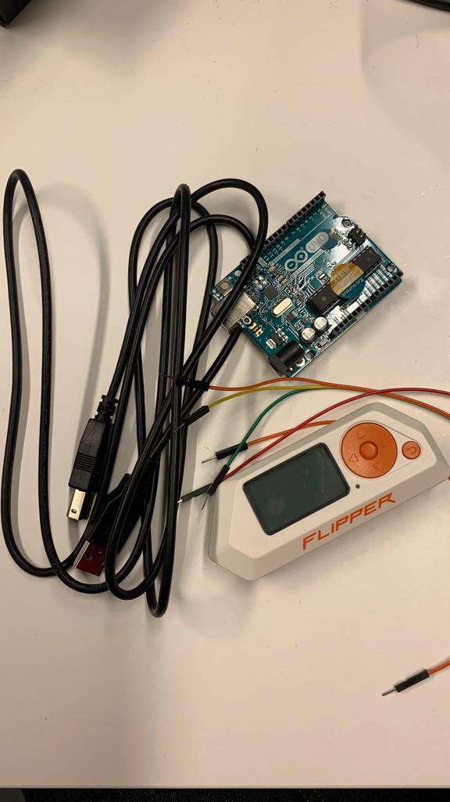
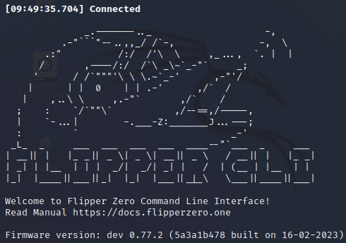

Software & Hardware Security Lab 6: Flipper Zero
====

## ToC

* [Preliminary tasks](#Preliminary-tasks)
* [Introduction](#Introduction)
    * [Practical arrangements of this lab](#Practical-arrangements-of-this-lab)
    * [Grading](#Grading)
    * [Deep Dive into Flipper Zero](#Deep-Dive-into-Flipper-Zero)


* [Tasks](#Tasks)
  * [Task 1](#Task-1)
  * [Task 2](#Task-2)
  * [Task 3](#Task-3)
  * [Task 4](#Task-4)
  * [Task 5](#Task-5)

# Preliminary tasks

Get familiar with following background information about Flipper Zero and RFID Access Control.

* Flipper Zero on [Wikipedia](https://en.wikipedia.org/wiki/Flipper_Zero)


Couple of articles explaining RFID Access Control systems
* Article 1: [RFID Access Control Breakdown](https://www.swiftlane.com/blog/rfid-access-control/)
* Article 2: [How RFID Access Control Works](https://www.rfidfuture.com/rfid-access-control.html)

# Introduction

This week’s theme is hardware security and how it can be exploited by hackers.
In this lab you will be using Flipper Zero device to perform hardware security experiments.
Introductory tasks revolve around theory of exploiting hardware
and advanced tasks include usage of actual device (Flipper Zero) to perform them.

[Flipper Zero](https://flipperzero.one/) is a portable multi-tool for pentesters and geeks in a toy-like body.
It loves hacking digital stuff, such as radio protocols, access control systems, hardware and more.
It's fully open-source and customizable and you can extend it in whatever way you like.


## Practical arrangements of this lab

This lab is little bit different than others because tasks require the usage of external device.
Number of devices are limited which causes some difficulties to arrangements.

* Students are encouraged to do the laboratory work in groups of 2, 3 or 4 if possible.
* Students are encouraged to borrow device do the lab ahead of schedule to balance load on actual lab week.
* We try to arrange loaning times so that everyone would have chance to hold device at least couple of days if they want.
* Answers to theoretical questions must be returned individually.

## Grading

The lab consists of five tasks. Their points are summarized below. "Good-to-have skills" are indicative only.
We assume that you work with groups, so the workload is adjusted based on that.

**You don't have to do tasks in order, but workload likely increases towards the end.**

Task | Points | Description | Good-to-have skills
--|:--:|--|--
1 | 1 | Familiarization with the Flipper Zero: initial setup, reading/saving basic tags, and reviewing technical articles on the device and RFID access systems | Article reading, RF fundamentals
2 | 1 | NDEF message creation and NFC reading with phone | Basic Flipper Zero operation, NFC standards
3 | 1 | Engineering a BadUSB attack with the Flipper Zero | Ducky Script, Linux, PowerShell
4 | 1-2 | Morse code application with infrared | Advanced Flipper Zero usage, C programming
5 | 1+ | Advanced experimentation (e.g., GPIO, Arduino integration, CLI, other modules) based on interest | Arduino, Hardware integration, CLI

---

## Deep-Dive into Flipper Zero

## Some control functions

Device can be powered on by holding and pressing illustrated button




Device can be rebooted as shown




Charging icons




## Setting up a brand new Flipper Zero

Flipper Zero might come with an outdated firmware.
In-order to use it, a firmware upgrade should be performed.
Flipper Zero stores all information on an SD card including databases and is also required for firmware upgrade.
Make sure to insert an SD card before updating the firmware.

[Qflipper](https://flipperzero.one/update) is a desktop application for updating firmware





**SD Card Installation:** Format SD card to exFAT or FAT32. Flipper Zero has a built-in format system which can be used to do this.
SD Card stores the auxiliary files that Flipper calls databases.
Many features of flipper zero require these auxiliary files to work properly. Therefore, it is important to have an SD card mounted.




All signal keys, remotes and card information captured are stored on the SD card as well.

## RFID Protocol Stack and Flipper Zero

Radio-wave technology is common nowadays in many places such as cards, gym keys, access machines e.t.c. The RF products are divided into two main broad categories:

    High frequency tags 13.56MHz (low range, some of them referred to as NFC ~Near Field Communication)

    Low frequency tags 125kHz (high range)

High frequency tags are more secure and used in credit cards etc. Whereas, low frequency tags are less secure and used in generic access keys or cards for example.
Moreover, high frequency tags support encryption, authentication and cryptography. Flipper Zero is constructed with dual-band RFID antenna and can interact with both of these.

---


# Tasks

You are recommended to start with Task 1 and proceed to the harder ones. Each task is designed to require more skills and effort than the previous one.

Tasks 1, 2 and 3 together are designed to take about 4 hours to complete, depending on your background. Try to finish them during the lab session. You can borrow equipment if you want to continue working on them at home.

Tasks 3 and 4 are more laborious, and it is likely they cannot be completed within a single lab session. Discuss borrowing equipment with the lab assistants if you want to work on these tasks.

> Some tasks require you to create videos and write reports. Video naming format: <task#_video>, for example <task2C_video>.
>
> Compress the videos into an archive and upload it to the Moodle return box alongside your answer template.

**If you are working in a group, remember that answers to theoretical questions must be individual. You are encouraged to research and discuss together, but write answers in your OWN WORDS.**

## Task 1

Task 1 is meant to be relatively simple to help you understand what the Flipper Zero is and what can be done with it.
You will submit answers to theoretical questions.

Flipper Zero can read and save information from many RFID tags and cards operating at low and high frequencies. Furthermore, these cards can be emulated by the Flipper Zero. This can eliminate the need to use the physical cards.

In this task, you will learn the basics of using the device to read NFC cards and RFID tags and to store them. Later, you will download the saved files and inspect them.

Read the section [Deep-Dive into Flipper Zero](#Deep-Dive-into-Flipper-Zero) before starting this task.

## A) Getting started with the device

The easiest way to get started with the Flipper Zero is to:
1. Format the SD card by going to Main Menu → Settings → Storage → Format SD card.
2. Download the latest firmware using qFlipper as instructed above.

## B) Testing the Flipper Zero on RFID and Infrared hardware

> We assume that you or one of your group members has at least some relevant devices or cards.
> If you don't have any, you can ask the course staff.

In this task, you need to use the Flipper Zero to read and save data from three different hardware devices using the following technologies/signals:

* High-frequency RFID/NFC (car keys, contactless credit cards, public transit cards, etc. — these are often cryptographically protected)
* Low-frequency RFID (access key fobs, old cards and passes, pet microchips)
* Infrared (different types of remotes: TV, audio systems, toys, lamps)

After reading and saving the different signals, try to emulate them using the Flipper Zero.
For example, some university access cards may lack proper protection and can be cloned or emulated.

**For each technology mentioned above answer the following questions**

**What device/hardware did you read?**

**What protocol/standard does it use?**

**Is the data Encrypted? If so, what type of encryption does it use (or your best guess)?**

**What information can be extracted from the signal and how it could be miss used? You can open the saved data on computer in text editor**

**Were you able to emulate the read signal? If yes, describe how well it worked; if not, explain why it might have not worked.**

**You can also include a video as proof**

>[!IMPORTANT]
>_Blur or remove any personal information._
> _Remember to delete all saved files from flipper before you return them._
---

## C) Understanding RFID and how Flipper interacts with it

This task has three sub-questions and you are expected to carry out research by surfing the internet or watching videos about Flipper. Answer the following three questions:

**What different kinds of RFID tags are present in the market? Is there a way to distinguish between them? How can you know if the RFID tag is secure by current best practices?**

It is necessary to know the RFID tag types so that you know how to interact with them and then work on exploiting them with Flipper Zero.

**How does Flipper Zero interact with different RFID tags? How do tag readers work in general?**

You should explain how the technology within Flipper Zero interacts with different types of RFID tags/cards. Furthermore, explain how tag readers work. What happens when a tag comes near a reader?

__Things to Consider__:
Your answers should include descriptions of the power sources of these tags and readers, mechanisms to activate them, how they emit radiation, and which frequency bands they utilize.

**What tools exist in the market and what mobile applications are available to access/read RFID devices?**

Links to devices and/or screenshots of mobile applications are enough. Write a small description of these tools/applications.
You can also try to search what rooted Android can be capable of.

---

## Task 2:
### NDEF message creation and NFC reading with phone


Most modern smartphones (Android ~2010+ and iPhone ~2014+) include NFC hardware that can read and write NDEF (NFC Data Exchange Format) messages, support contactless payments, and perform host card emulation (HCE).
We assume that your group has a phone which is capable of reading NFC tags.

Phones process unencrypted NDEF records directly to trigger supported actions; encrypted NDEF content requires a specific app. The user is typically prompted before the action executes.


1. Connect to Wi‑Fi using SSID, password, and encryption type
2. Open a URL / website
3. Share or save contact information (vCard)
4. Initiate a call or send an SMS
5. Send an email
6. Launch installed apps via URL schemes / open images
7. Trigger or change basic phone settings
8. Display text

Your task is to create an NFC tag (NDEF message) with Flipper Zero that a phone can read to execute two or more of the above actions. 
The goal is to generate and write the NDEF message, as a `.nfc` file and move this file into Flipper Zero, and successfully emulate the data contents, finally reading the action with your phone.
You should try and document at least two different functionalities as described above.

> [!NOTE]
> Do not use existing Flipper Zero applications to generate the NDEF bytes. Instead, manually construct the raw byte sequence. This low‑level approach helps you understand format at least on some level.
>
> You may use existing libraries only to validate your handcrafted NDEF message before loading it onto the Flipper Zero.


You can use Python to write files, and, for example, the [ndeflib](https://github.com/nfcpy/ndeflib) Python library generate and validate the  messages.
See the [relevant docs part, which also describes known record types.](https://ndeflib.readthedocs.io/en/stable/records.html)


Verify iOS compatibility for the selected functionality [here](https://gist.github.com/equipter/de2d9e421be9af1615e9b9cad4834ddc) and [here](https://developer.apple.com/documentation/corenfc/adding-support-for-background-tag-reading) , if you happen to have iPhone.
For Android, some documentation is available [here](https://developer.android.com/develop/connectivity/nfc/nfc).

### Creating the .nfc file

The `.nfc` file format is described in the Flippers [docs.](https://developer.flipper.net/flipperzero/doxygen/nfc_file_format.html)
For example, we can use NTAG215 chip emulation.
Then emulation should be based on NTAG/Ultralight format.

In order to do that, open NFC app from the Flipper and create new tag template manually, by choosing the NTAG215 option.
Connect Flipper to computer, and use `qFlipper` to download the `.nfc` file on your local computer.
We need to modify the .nfc file to inject the NDEF payload into the data pages. The pages begin as shown below; we will place the payload starting at Page 4 and onward, using the TLV (Type-Length-Value) structure.
The following information is mostly obtained from NTAG215 [datasheet](https://www.nxp.com/docs/en/data-sheet/NTAG213_215_216.pdf), but you shouldn't need it.

```
Page 0: 04 CF 5A 19 - 3 first UUID bytes + BCC0 (BCC0 = 0x88 ⊕ UID0 ⊕ UID1 ⊕ UID2)
Page 1: 53 82 9D 80 - remaining 4 bytes of UUID 
Page 2: CC 48 00 00 - BCC1 = UID3 ⊕ UID4 ⊕ UID5 ⊕ UID6 + internal byte + lock bytes
Page 3: E1 10 3E 00 - E1 (NFC Compliant), 10 (NFC 1.0 support), 3E (496 bytes in data memory area), 00 (not write protected)
Page 4: 03 00 FE 00 - empty NDEF message
```

If you're interested, NDEF is highly backward compatible. You can consult the original 1.0 standard from 2006—publicly available [here](https://freemindtronic.com/wp-content/uploads/2022/02/NFC-Data-Exchange-Format-NDEF.pdf)—to examine NDEF at the byte level. Using a library will generate the correct bytes.

In order to make compatible NDEF payload, it must meet the following when filling pages, starting from page 4:

1. The first byte 0x03 stands for NDEF type.
2. Second byte must be length of the NDEF payload
3. As many bytes as required to put the NDEF payload. (note that payload with more than 256 bytes uses different protocol)

After the modifications, upload `.nfc` file back to Flipper. In NFC app, you can read the info part from the tag, and see if it correctly has NDEF data. 


### Return:
1. A short report describing how you performed the exercise (including code)
2. Which actions you implemented and why
3. The exact NDEF message(s) (as final `.nfc` files)
4. (Optional) A demo video showing the phone reacting to the tag

>[!IMPORTANT]
> Blur or remove any personal information in screenshots or videos.  
> Delete all saved files on the Flipper Zero that may contain personal information before returning the device.
> At least on iPhone, reading the NFC tag must happen exactly on the correct place.

We didn't do any "real" hacking on this task, but security has relied too much for obscurity in the past. You may now get started with NFC to do something more!
Previously created `.nfc` files represent data which can be found from actual chips.

---

## Task 3
### Design a BadUSB attack to steal passwords by plugging in a Flipper Zero and sending them via email

In this task, you will learn how to use the BadUSB module in the Flipper Zero and use it as a powerful BadUSB for penetration testing.

BadUSB attacks exploit the inherent trust computers place in USB devices. These attacks typically involve reprogramming a USB device (such as a flash drive or a seemingly harmless device like a keyboard) to act as a malicious device that can execute various actions.

For example, a BadUSB device might present itself as a keyboard and start typing a series of commands on the target system. These commands could include downloading and executing scripts that attempt to extract sensitive information, such as Wi‑Fi credentials.

Because Wi‑Fi credentials are often stored to enable automatic connections, a BadUSB attack could target relevant configuration files or use other methods to access them. The extracted credentials can then be exfiltrated, for example via a PowerShell script sent over email.

### Getting Familiar with Ducky Script

## A) Writing a script to open a shell on Linux

In this task, you will practice writing scripts that open a shell.

Ducky Script tutorial: https://web.archive.org/web/20220816200129/http://github.com/hak5darren/USB-Rubber-Ducky/wiki/Duckyscript

If you are interested in BadUSB scripts for the Flipper Zero, you can find many examples on the internet (GitHub). For example:
- https://web.archive.org/web/20231218132739/https://github.com/UNC0V3R3D/Flipper_Zero-BadUsb
- https://github.com/I-Am-Jakoby/Flipper-Zero-BadUSB

See the code below, which opens PowerShell on Windows.

```shell
DELAY 100
GUI r
DELAY 100
STRING powershell
DELAY 100
```
**Write a script to open a shell on Linux. Paste your script below.**

NOTE: You can test your script only on USB Rubber Ducky compatible devices. These tools emulate a keyboard and execute scripts on a target computer.

HINT: To test your solution, copy and paste it into the Flipper Zero’s `badusb` folder. Connect it to a PC and run the script from your device.

## B) Engineering a complete script to steal a password from a text file and send it over email

Before proceeding with this task, you’ll need to install PowerShell on your virtual machine. Installation instructions are provided here for Arch Linux (reference guide): https://ephos.github.io/posts/2018-9-17-Pwsh-ArchLinux

```shell
# POWERSHELL INSTALL SCRIPT FOR ARCH LINUX
# Clone the AUR package down with git, use the "Git Clone URL"
git clone https://aur.archlinux.org/powershell-bin.git

# Navigate into the directory from the Git clone
cd powershell-bin

# AUR Packages are community created, MAKE SURE YOU REVIEW THE FILES BEFORE INSTALL!
cat PKGBUILD

# Run makepkg to build the AUR package, '-s' will sync dependencies, '-i' will install the package after build.
makepkg -si
```


You are given a sample network file called [networkfile.nmconnection](misc/networkfile.nmconnection) that contains Wi‑Fi credentials for a network named "Cross." Now that you are familiar with Ducky Script, your goal is to write a script that automatically extracts the full password and SSID from this file and then emails them to win10_9121@outlook.com.

To aid you in this task, Flipper Zero includes a sample Wi‑Fi credential‑stealing script written in Ducky Script in the following directory: _`SD Card/badusb/Wifi-Stealer_ORG.txt`_ (filename: Wifi-Stealer_ORG.txt).

However, this script targets Windows and does not include an automated email‑sending component using PowerShell.

The contents of the file are provided below for reference:

```shell
REM Title: Wifi Stealer
REM Author: 7h30th3r0n3
REM Target: Tested on Windows 7/8/10/11
REM Version: 1.0
REM Category: Grabber
REM Extracts the SSID and wifi shared key and puts them in a txt file named 0.txt on the desktop
GUI r
DELAY 500
STRING powershell
ENTER
DELAY 500
STRING cd C:\Users\$env:UserName\Desktop; netsh wlan export profile key=clear; Select-String -Path WiFi-* -Pattern 'keyMaterial' | % { $_ -replace '</?keyMaterial>', ''} | % {$_ -replace "C:\\Users\\$env:UserName\\Desktop\\", ''} | % {$_ -replace '.xml:22:', ''} > 0.txt; del WiFi-*;exit
ENTER
```
First, download the provided configuration file ([download link](misc/networkfile.nmconnection)) to your virtual Linux machine. Using Ducky Script, craft an attack that:

i) Finds the downloaded configuration file  
ii) Extracts the Wi‑Fi password and SSID from it  
iii) Sends the password and SSID to the following email address as plain text in the email body: win10_9121@outlook.com

Recommended steps:

i. Download the Wi‑Fi credentials file to your machine.  
ii. Write a Ducky Script on your machine and save the file.  
iii. Transfer it to the Flipper Zero `badusb` folder using the qFlipper app.  
iv. Connect the Flipper Zero to a virtual Linux VM.  
v. Run your script from the Flipper Zero for testing.  
vi. Repeat until the results are correct.


__HINT__: You should place your script in following directory of flipper: _SD Card/badusb/<your_script>_

This task will require some trial and error from your side before finally being able to steal credentials and send automatically over email. Partial marks can be awarded to good attempts.

>[!WARNING]
> Bad USB scripts can be very dangerous as they execute shell commands. Writing a wrong script can potentially damage the functionality of your OS or machine. Therefore, it is advised
to carry out badUSB attack on a virtual linux VM, to avoid harming your computer.

### What to return in this task?

You must return next 2 items to return template to gain points from this task:
1. Your working attack script.
2. Proof of success. A small video capturing the process. Compress and upload it to moodle or provide link from a streaming service.

>[!NOTE]
> Replace your SMTP email and password with dummy when submitting script. You could replace your authentication email with email@gmail.com, and password with abc1234 for example

---
## Task 4
### Getting started with app building and infrared module

> We hope that your group has at least one device that can receive infrared signals, and there is a way to demonstrate that the signal was successfully transmitted.
> You can also complete the task using pre-recorded signals and demonstrate your work during the lab session.

> [!NOTE]
> **You can combine** this task with the task 5 if you create a more sophisticated application. Fulfilling only the minimum from below is worth of 1 point.

Flipper Zero provides many powerful features out of the box, but how can we implement some of them ourselves? A key distinction between a "script kiddie" and an engineer is the ability to build rather than simply reuse others' work. In this task, you will create a minimal Flipper Zero application to learn the basic development workflow.

There are two common ways to build an application for Flipper Zero: with the C language by creating [FAPs](https://developer.flipper.net/flipperzero/doxygen/apps_on_sd_card.html) or by using the [JavaScript engine](https://developer.flipper.net/flipperzero/doxygen/js.html).
The advantage of the C approach is the precise control and full capabilities, but the app must be compiled and linked against every firmware version.
By using the JavaScript engine, you don't need to compile the code every time, and the only requirement is API compatibility against the currently used JavaScript SDK version.

Unfortunately, the JavaScript engine of the official firmware does not support the infrared features yet - so we are going to try some C programming.

### Initial development environment setup

Before you begin, you'll need to set up the Flipper Zero development environment. This includes:
- Getting the Flipper Zero firmware source code
- Setting up the build toolchain
- Understanding the application structure and APIs

Flipper Zero has a build tool [`uFBT`](https://github.com/flipperdevices/flipperzero-ufbt) (minimal version from the whole Flipper build tool) which does most of the job already.

After installation, you can create the bootstrap code with command `ufbt create APPID=<fancy_app>` in your chosen directory which downloads necessary dependencies and sets the build chain.
To see the metadata of the initial project, see file `application.fam`. 

To get VSCode development integration, run `ufbt vscode_dist`.

> [!NOTE]
> From this point forward, you should connect Flipper with USB for the same computer, so that we can upload the build files.

You can try the template project (see `template.c`) by compiling it with the `ufbt` command, and then launching it on the Flipper with the command `ufbt launch`.
For more information, see the project's main README.

The default template simply prints some data to the log.
You can observe this by starting the Flipper CLI with the command `ufbt cli` and typing `log`, which shows all ongoing logging messages.
The template app is in the `Apps -> Examples` location. If you run the app, you can see logging prints from the original source code.

You can also try a more concrete example which prints `Hello, Flipper!` on the Flipper's screen:

```c
#include <furi.h>
#include <gui/gui.h>

/* generated by fbt from .png files in images folder */
#include <template_icons.h>

// This is the function that will be called to draw on the screen
static void app_draw_callback(Canvas* canvas, void* context) {
    UNUSED(context);

    // Clear the screen before drawing
    canvas_clear(canvas);
    // Set the font we want to use
    canvas_set_font(canvas, FontPrimary);
    // Draw the string on the canvas at coordinate (2, 22)
    canvas_draw_str(canvas, 2, 22, "Hello, Flipper!");
}

// Main application entry point
// This must be same as the entrypoint in application.fam
int32_t template_app(void* p) {
    UNUSED(p);
    FURI_LOG_I("TEST", "Starting application...");

    // Create a ViewPort. This is our drawing canvas.
    ViewPort* view_port = view_port_alloc();
    // Set the function that will be used for drawing
    view_port_draw_callback_set(view_port, app_draw_callback, NULL);
    // Get the GUI service and add our ViewPort to it to make it visible
    Gui* gui = furi_record_open(RECORD_GUI);
    gui_add_view_port(gui, view_port, GuiLayerFullscreen);
    // Keep the application running for 5 seconds
    furi_delay_ms(5000);
    // Clean up before exiting: remove the ViewPort and free the memory
    gui_remove_view_port(gui, view_port);
    view_port_free(view_port);
    furi_record_close(RECORD_GUI);
    FURI_LOG_I("TEST", "Ending application...");

    return 0;
}
```
### Trying out infrared module with morse code 

**Your job is to expand the previous code to send IR signals.**
Adding any GUI functionality is not required, while not forbidden. 
The idea is to use something binary (like light going on/off) to transfer a morse code message.
See [international morse code](https://en.wikipedia.org/wiki/Morse_code).

You have two options:

#### Option 1: IR controllable led lamp

We have pre-captured existing IR signals and you should create a program to use them. You would need to test *the application in the lab session*. See files [lamp.ir](lamp.ir) and [lamp_ir_constants.h](lamp_ir_constants.h). The LED lamp uses the `NECext` protocol. Before coming to the lab session, you can verify with a phone camera that IR lights are blinking on the Flipper.
Optionally, you can also add support for blinking Flipper's led lights at the same time.



#### Option 2: Something you own

Alternatively, you can use your own device. You must capture the signals yourself with the infrared module and use them here. You can find the `.ir` data files when you use `qFlipper`; they are located in the `infrared` folder on the SD Card.

#### Development process

Get used for the iteration process of the sample application. Basically, use `ufbt launch` to build and launch the app in Flipper. If you need to see the log files, find the app from Flipper, and run it while you are listening logs with `ufbt cli` with `log debug` command.

Then, the overall process for both cases is like following:
 1. Capture the IR signals and create header file for the protocol (like [lamp_ir_constants.h](lamp_ir_constants.h), not needed for option 1)
 2. See the infrared APIs listed below on how to construct message and send it with IR. Friendly LLM may help.
 3. For the option 1, you can send morse code by blinking lamp on/off or changing colors. Or use imagination.

#### More material 

See infrared [file format](https://developer.flipper.net/flipperzero/doxygen/infrared_file_format.html).
You mainly need this if you use your own device and you are trying to transfer the data for C application. Use the lamp's sample files as an example.

API functions for sending signal with hardware are available [here](https://developer.flipper.net/flipperzero/doxygen/infrared__transmit_8h_source.html).

The API functions of lower-level the `infrared.h` is available [here](https://developer.flipper.net/flipperzero/doxygen/infrared_8h_source.html). Needed for message format and raw signals.

The best way to read these docs is to include them in your source file, then right-click in VSCode and select "Go to Definition".


If you want to use leds, see [notification.h](https://developer.flipper.net/flipperzero/doxygen/notification_8h_source.html) and overall [Notification module](https://developer.flipper.net/flipperzero/doxygen/dir_4da8169f4b01534df2bf9de29542a49e.html).

For example, vibrating Flipper could look like (truncated):
```c
#include <notification/notification_messages.h>
#include <notification/notification.h>
// Get notification service for vibration
NotificationApp* notifications = furi_record_open(RECORD_NOTIFICATION);

// Following sequences are defined in notification_messages.h

// Single vibration
notification_message(notifications, &sequence_single_vibro);
furi_delay_ms(500);

// Double vibration
notification_message(notifications, &sequence_double_vibro);
furi_delay_ms(1000);

// Success vibration
notification_message(notifications, &sequence_success);

// Clean up notification service
furi_record_close(RECORD_NOTIFICATION);
```


For many more Flipper examples, see: https://github.com/flipperdevices/flipperzero-firmware/tree/dev/applications/examples


https://instantiator.dev/post/flipper-zero-app-tutorial-01/

https://instantiator.dev/post/flipper-zero-app-tutorial-02/


### What to return

**The workload here isn't actually that much** - you only need to construct correct message types and use a few function calls, if the protocol is already supported by Flipper!
With correct timing, map the possible alphabet against morse code, and use some functionality on the target device that can show binary information.
Optionally, add visual feedback using the device's screen or LEDs.

> You should return the source code, IR files if you used your own device, and with your own device, you should also return a short demo video.
> Also include a short description of what you did and whether you had any challenges.

---
## Task 5
> If you put in a lot of work on this task, you can earn more than one point. Use your imagination with real-life systems you have permission to access!

Still want something more complex? You are freely encouraged to dive into your creativity to come up with a possible experiment. Sample options are given as a reference only. You can come up with your own and write a report about it.

There is no answer template for this tasks, but you are expected to make videos of successful experimentation as a proof and write a report:
 * Report must clearly show all the work you did. Otherwise it would be really hard to give you any kind of points.
 * Also remember that even if long and exhaustive report is usually considered as good, you do not have to be *too* exhaustive. We would like to see students use their time to do interesting experiments rather than using time to write overly long reports. You yourself decide what is important to tell and what is not.
 * Notice that even failed attempts might give you some points if report shows that your try was well thought out.

### What to return in this task?

You must return the following 2 items for this task and any other supplementary work (such as scripts, extracted info) you consider necessary:
1. A report explaining your plan of action, experiment and results. Write it in the return answer template file
2. Videos of experiments showing your work with Flipper Zero

Videos should be compressed and uploaded to Moodle directly with your return answer template submission.

> Your report should include:
* What is the experiment about? Plan of action
* Objective of this experiment? Intended outcome/result  
* Hardware and software setup required to achieve it
* Actual experiment details, challenges and roadblocks faced
* Video recordings of experiments

## Option 1. Flipper Zero and GPIO

Flipper Zero includes a GPIO module. GPIO stands for General Purpose Input/Output and refers to pins on a microcontroller or similar device that can be configured for input or output to communicate with other hardware components.

Detailed information on the pinout and functionality can be found in the official Flipper Zero documentation: https://docs.flipper.net/gpio-and-modules

You can interface a compatible hardware device of your choice, or you can borrow an Arduino UNO from the lab assistants to carry out this task. The image below shows equipment available for this task.



A serial communication channel can be established between the Flipper and an Arduino by connecting the RX and TX pins and sharing a common ground. However, more information on this subject cannot be disclosed, and it is the students’ responsibility to study, research, and experiment to achieve a concrete objective.

A sample idea: Firmware extraction from an Arduino

- Connect the Flipper Zero to the target device using relevant interfaces (JTAG, UART, SPI, etc.).
- Use Flipper Zero’s hardware plugins or modules to interface with the target’s debug or communication ports.
- Attempt to extract firmware from the target device using the available interfaces. For example, you might use the UART module to capture data sent during the boot process.

Helpful document: https://arduino.stackexchange.com/questions/49476/is-it-possible-to-extract-a-hex-file-via-uart-from-an-arduino/49497#49497

If you plan to pursue this option, you will need to install the Arduino IDE on your Linux machine.

#### A note on installing the Arduino IDE on Arch Linux

Arduino IDE is not available in the Arch User Repository (AUR), which means you need to use an AUR helper like yay, brew, or manually build and install the package.

```shell
# Install yay

git clone https://aur.archlinux.org/yay.git
cd yay
makepkg –si

# Install arduino
yay -S arduino
```
## Option 2. Flipper Zero and CLI

Alternatively, you can explore the Flipper Zero’s command-line interface (CLI) from your computer. Flipper includes a hidden CLI that you can use to send commands and establish a communication channel at a frequency of your choosing.

"tio" (short for "tty input/output") is a command-line tool for serial communication that allows you to interact with serial devices such as microcontrollers and modems. You will need a tool like tio to establish a communication channel between the Flipper and your computer in order to access the CLI at a specified baud rate. Read more about the tool here: https://github.com/tio/tio



A sample idea: Establish a Sub-GHz communication channel

- Connect the Flipper Zero to your machine. Use a tool like tio and run the appropriate command to open the Flipper CLI.
- To ensure proper serial communication between the Flipper and the CLI, set the correct baud rate.
- Once you have accessed the CLI, list the available commands. Establish a communication channel at your chosen frequency and broadcast some test messages.
- Record and document your progress. Include the commands you used.

NOTE: You might have to change some udev rules to allow communication. It is up to you how you proceed with this option.

## Option 3. Your choice

If you have another topic that uses Flipper Zero or is related to hardware security and you are interested in trying it, you can do so and document the process and results. For inspiration, you can look for ideas on what others are doing with Flipper Zero on GitHub and YouTube. To be accepted as Task 4, your idea must require a skill and workload level comparable to Options 1 and 2. REMEMBER: Before you pursue your custom idea, contact the assistants to ensure the topic is acceptable.

List of submodules present in the Flipper:

- NFC (high frequency)
- 125 kHz RFID
- Infrared
- Sub-GHz
- Sub-GHz Remote
- Sub-GHz Playlist
- IR Remote
- GPIO (Input/Output pins)
- iButton
- Bad USB
- U2F (Open Authentication Standard)

The Applications section of the device also contains useful folders. Students can explore this section, create an experiment with a clear objective, and write a report about it to complete this task.

You can also ask the course assistants for additional ideas. They may have interesting preliminary concepts that are not yet refined enough to include in this documentation. They are happy to share them, and it is up to you to refine the idea.
